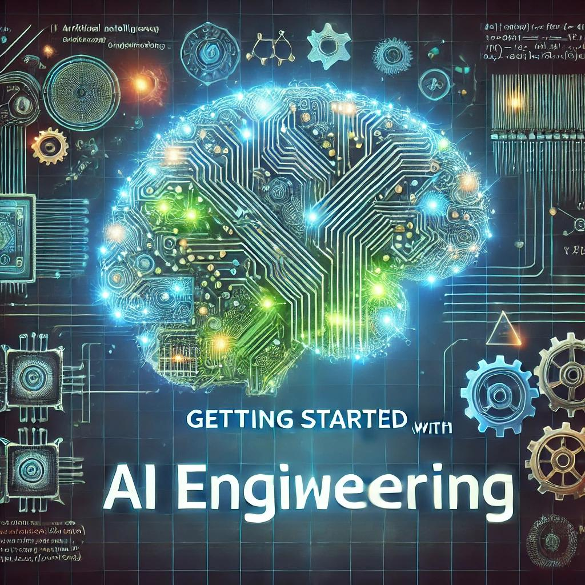

Welcome to my first blog post! In this article, I'll introduce you to AI Engineering and share what you can expect from this blog.

## What is AI Engineering?

AI Engineering combines software engineering principles with machine learning and artificial intelligence to build robust, scalable AI systems.

## What to Expect

In this blog, I'll be covering:
- Best practices for AI/ML systems
- Practical tutorials and code examples
- Project showcases and learnings
- Industry trends and insights

Stay tuned for more content!
