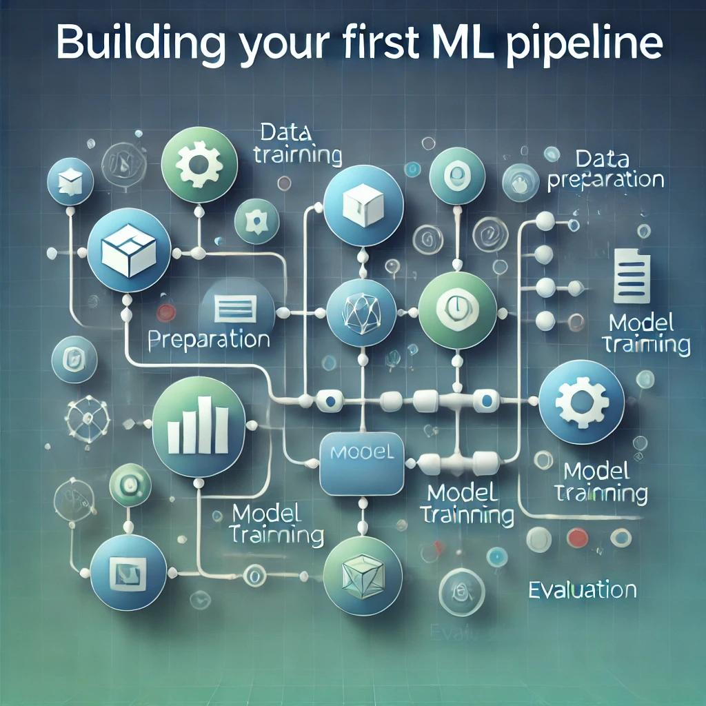

In this tutorial, we'll build a simple but production-ready ML pipeline using Python.

## Prerequisites

- Python 3.8+
- Basic understanding of ML concepts
- Familiarity with pandas and scikit-learn

## The Pipeline Structure

Here's a basic example of a modular ML pipeline:
