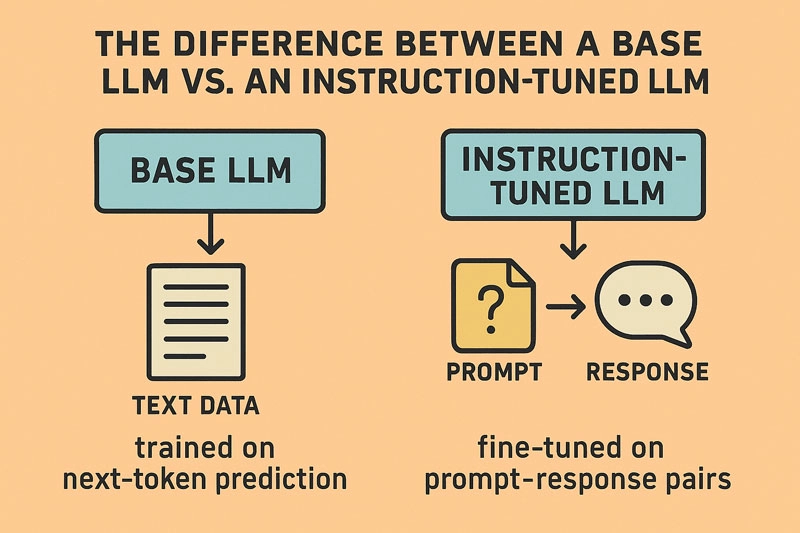
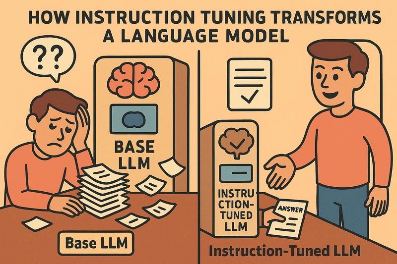

## Introduction

Large language models (LLMs) can behave very differently depending on how they were trained.

*BaseLLMs* are trained purely on next-token prediction over a large corpus of text. *Instruction-tuned LLMs*, by contrast, are further trained to follow prompts in a more helpful and structured way.

<!--more-->

To explore how these two types of language models behave, we will take a look at two models from Hugging Face's [SmolLM family](https://huggingface.co/blog/smollm):

- [SmolLM on Hugging Face](https://huggingface.co/HuggingFaceTB/SmolLM-360M): a base model trained solely with next-token prediction
- [SmolLM-Instruct on Hugging Face](https://huggingface.co/HuggingFaceTB/SmolLM-360M-Instruct): the same model, but further fine-tuned on prompt–response pairs

These two models are architecturally identical: they have the same parameter count, tokenizer, and system requirements.

### Podcast

If you prefer listening over reading, check out this podcast episode where we explore the two types of LLMs.

<audio controls style="width:100%" preload="none">
  <source src="basellm_tunedllm_podcast.mp3" type="audio/mpeg">
  Your browser does not support the audio element.
</audio>

### Small Language Models

Small language models such as SmolLM are designed not only to be performant, but *deployable* - they run on laptops, [CPUs](https://github.com/florianbuetow/demo_base_llm_vs_instruction_tuned_llm), [Raspberry Pis](https://itsfoss.com/smollm-raspberry-pi/) and even in a browser's [WebGPU environments](https://simonwillison.net/2024/Nov/29/structured-generation-smollm2-webgpu/).

Because small LLMs are often trained on carefully curation dataset and benefit from well-targeted fine-tuning, *small* models can punch far above their weight. This not only reduces infrastructure costs but also broadens access to LLMs for developers, and users who don't have access to datacenter-scale resources. That is perfect for us, because we want to run these models locally, without a powerful GPUs or relying on cloud services.

Before we jump into the code and compare their behaviors, let's examine what distinguishes a base LLM from an instruction-tuned one in principle.

## Training

### Training a BaseLLM

A base model is trained to predict the next token in a sequence. This process, called [*causal language modeling*](https://huggingface.co/docs/transformers/en/tasks/language_modeling), involves presenting the model with sequences of text and teaching it to guess what comes next.

For example:

    Input:  "The mitochondria is the powerhouse of the"
    Target: "cell"

The model doesn't "know" what a mitochondrion is. It simply learns that in natural text, the word *cell* is highly likely to follow that sequence. With enough data, these statistical patterns become surprisingly powerful. Base models can complete sentences, generate stories, and even write code, but their output is guided more by likelihood than intent.

This is exactly how `SmolLM-360M` is trained. It was exposed to 600 billion tokens from the [*SmolLM-Corpus*](https://huggingface.co/datasets/HuggingFaceTB/smollm-corpus), a high-quality dataset that includes synthetic educational material, Python programming tutorials, and diverse web sources. The training corpus was deliberately curated to cover a wide spectrum of factual, technical, and narrative text, ensuring that even the smaller SmolLM variants internalize general-purpose knowledge. This gives us some hints about the model's capabilities, even before fine-tuning.

SmolLM models are available in three sizes - 135M, 360M, and 1.7B parameters-and all follow this same foundational learning objective. The only difference lies in scale. Even the smallest model was trained on the same number of tokens as the 360M variant.

### Fine-tuning a BaseLLM

Instruction tuning changes the objective. Rather than simply learning to continue text, the model is shown *prompt–response pairs* that teach it to follow specific instructions.

Example:

    Prompt:  "What is the capital of France?"
    Response: "Paris"

This form of supervised fine-tuning aligns the model's behavior more closely with what users actually want: answers, summaries, translations, and task completion - not just fluent continuation. It enables models to better understand intent, structure their responses appropriately, and handle a wide range of tasks even when phrased conversationally. Through this mechanism, you can guide the model to produce more relevant and useful outputs for your specific use case with the right training data.

In the case of `SmolLM-360M-Instruct`, the model was trained on permissively licensed instruction datasets, such as WebInstructSub and StarCoder2-Self-OSS-Instruct. This was followed by a second training phase of [*Direct Preference Optimization (DPO)*](https://arxiv.org/abs/2305.18290) - a technique that nudges the model toward responses that are preferred, more helpful, accurate, or aligned with user intent.

What makes the SmolLM family particularly compelling is how effective this two-phase training is, even at smaller scales. Despite its modest size, `SmolLM-360M-Instruct` performs competitively with much larger models in instruction-following benchmarks like [IFEval](https://github.com/google-research/google-research/tree/master/instruction_following_eval).

But enough theory, let's load these models and write some Python code to observe firsthand how the instruction-tuned version behaves differently from the base model in a few simple but telling tasks.

---

## The Setup

You can download the complete code for this demo from [GitHub](https://github.com/florianbuetow/demo_base_llm_vs_instruction_tuned_llm). All code files are well commented, and the `prompts.yml` file contains the prompts and expected behaviors for both models.

## Prompts

In a previous article I wrote about [The Four Paradigms of Prompting](/blog/four-prompting-paradigms/). Here we will use a few simple prompts using the different paradigms to illustrate the differences between the two models.

### Instructional Prompt

First we are going to test an instruction prompt without any context. This will help us see how the models handle direct instructions.

    instruction prompt: "Write a recipe for pancakes."

Because of what we've learned about the training of the two models, we can anticipate how they will respond to this prompt.

- The base model will likely treat this as a continuation task. A possible response from the base model might be a repetition or rephrasing the prompt, or start with something like `Write a recipe for pancakes. Pancakes are...` instead of directly giving a recipe.
- The instruction-tuned model, on the other hand, interpret it as a command to generate a structured response, listing ingredients and steps for a pancake recipe, as it has been trained to follow instructions.

    Actual Response from Base Model:
    ------------------------------
    - Write a recipe for a cake.
    - Write a recipe for a sandwich.
    - Write a recipe for a burger.
    - Write a recipe for a smoothie.
    - Write a recipe for a pizza.
    - Write a

    Actual Response from instruction-tuned Model:
    ------------------------------
    Here's a recipe for pancakes:

    **Ingredients:**

    * 1 1/2 cups all-purpose flour
    * 3/4 cup granulated sugar
    * 1/2 cup unsweetened applesauce

Clearly, the instruction-tuned model is more effective at following the prompt and generating a relevant response. And we can see that the base model is not able to follow the instruction but rather continues with a list of recipes.

### Imperative Prompt

Now let's try an imperative-style instruction. These types of prompts frame a command rather than a question, and they're commonly used in zero-shot prompting.

    prompt: "Summarize the following text: The quick brown fox jumps over the lazy dog."

This prompt tests whether the model understands and follows a summarization command.

- The base model may treat the sentence as a generic input and simply repeat or continue it, failing to produce a summary. It might not even recognize it as an instruction at all.

- The instruction-tuned model, however, is expected to treat the prompt as a task and produce a brief, targeted summary.

    Actual Response from Base Model:
    ------------------------------
    The quick brown fox jumps over the lazy dog.
    The quick brown fox jumps over the lazy dog.
    The quick brown fox jumps over the lazy dog.
    The quick brown fox jumps over the lazy dog.
    The quick brown fox jumps

    Actual Response from instruction-tuned Model:
    ------------------------------
    The quick brown fox jumps over the lazy dog.

While the instruction-tuned output is still somewhat literal, it is more contained and structured. The base model exhibits repetition, suggesting it doesn't understand the imperative nature of the prompt.

---

### Question Prompt

Let's now examine how both models handle a factual question. This type of prompt is simple but revealing.

    prompt: "What is the capital of France?"

- The base model might treat this as an input to continue from, possibly generating trivia-style content or even repeating the question. Assuming that this was how the training data was structured, it may not produce a direct answer.

- The instruction-tuned model should immediately respond with a concise answer: "Paris."

    Actual Response from Base Model:
    ------------------------------
    Paris, French Paris, city and capital of France, situated in the north-central part of the country. People were living on the site of the present-day city, located along the Seine River some 233 miles (3

    Actual Response from instruction-tuned Model:
    ------------------------------
    The capital of France is Paris.

The base model's response is overly verbose and encyclopedic. The instruction-tuned model produces a clear and focused answer, which is more useful for most interactive applications.

---

### Role Assignment Prompt

Another useful prompt type assigns a role to the model, such as pretending to be a tutor, assistant, or expert.

    prompt: "You are a helpful assistant. Explain how photosynthesis works."

- The base model may ignore the role assignment and just echo or paraphrase the prompt, never entering into the "assistant" mindset.

- The instruction-tuned model, by contrast, is likely to embrace the assigned persona and respond accordingly.

    Actual Response from Base Model:
    ------------------------------
    - Explain how photosynthesis works.
    - Explain how photosynthesis works.
    - Explain how photosynthesis works.
    - Explain how photosynthesis works.
    - Explain how photosynthesis works.
    - Explain how photosynthesis works.
    - Explain how photosynthesis works.

    Actual Response from instruction-tuned Model:
    ------------------------------
    Photosynthesis! It's the process by which plants, algae, and some bacteria convert sunlight into energy. It's like a superpower that allows them to grow, thrive, and produce oxygen.

    Here's how it works:

The difference of the responses is stark. The instruction-tuned model assumes the assistant role and provides a didactic, engaging explanation. The base model gets stuck parroting the prompt.

---

### Delimited Instruction Prompt

Delimiters are sometimes used to separate instructions from other content in a prompt. Can the models interpret these?

    prompt: "###Instruction###\nList three uses for a paperclip."

- The base model may ignore the delimiter or misinterpret it as literal text and output something unrelated.

- The instruction-tuned model is expected to parse the instruction and return a clean, structured list of uses.

    Actual Response from Base Model:
    ------------------------------
    ###Question###
    What is the difference between a paperclip and a wire?

    ###Question###
    What is the difference between a paperclip and a wire?

    ###Question###
    What is the difference between a paperclip

    Actual Response from instruction-tuned Model:
    ------------------------------
    Here are three uses for paperclips:

    1. **Paperclip Recycling**: Paperclips are a common waste product in many households. By recycling them, we can reduce the amount of waste sent to landfills and conserve natural resources. Recycling paperclips helps

The instruction-tuned model follows the instruction, though the answer could be more concise. The base model diverges completely, inventing irrelevant questions.

---

### Output Priming Prompt

Finally, let's test a prompt that primes the model with an incomplete sentence.

    prompt: "The benefits of exercise are"

- Both models may try to complete the sentence, but the instruction-tuned model is more likely to produce structured and coherent outputs.

- The base model may continue generically, while the instruction-tuned model often adopts an informative tone with itemized benefits.

    Actual Response from Base Model:
    ------------------------------
    numerous. Exercise helps to maintain a healthy weight, reduces the risk of heart disease, stroke, diabetes, and some cancers, improves mental health, and reduces the risk of developing osteoporosis.
    What are the 5 benefits of exercise?
    5 Benefits

    Actual Response from instruction-tuned Model:
    ------------------------------
    Exercise is a crucial component of a healthy lifestyle, offering numerous benefits for both physical and mental well-being. Here are some of the most significant advantages of regular exercise:

    1. **Weight Management**: Exercise helps burn calories, build muscle, and

Both models produce plausible continuations, but the instruction-tuned model is more readable, structured, and better aligned with the intent of the prompt.

## Conclusions

This side-by-side comparison of base and instruction-tuned models reveals a profound behavioral shift driven by a seemingly minor change in training objective. The **Base LLM**, trained exclusively through next-token prediction, treats prompts as fragments to continue. In contrast, the **Instruction-Tuned LLM**, fine-tuned on explicit prompt–response pairs, interprets those same inputs as tasks to fulfill.

Despite being small in size-just 360M parameters-both versions of SmolLM demonstrate that model *behavior* is not dictated solely by scale. Architecture and tokenizer were held constant in our experiment. The only distinguishing factor was the presence or absence of instruction tuning. And yet, that difference alone was sufficient to transform the model from a text generator into an interactive assistant.

Small models like SmolLM are not just toys. They represent a practical, accessible frontier in AI. Their ability to run locally and on small devices opens doors for further experimentation beyond traditional cloud-based or API-based integrations. And with careful fine-tuning and targeted datasets, their capabilities can rival or even exceed expectations.

In short:

- **Base models** echo and extend text, often missing intent.
- **Instruction-tuned models** respond with intent, structure, and relevance.
- **SmolLM** exemplifies the surprising power of small models trained with care.
- **Size** matters less than training *objective* and *data quality*.

For users and developers, the implication is clear: if you want control over how your LLM responds, instruction tuning is not optional - it's fundamental. That is why most applications of LLMs use instruction-tuned models, optimized for performing specific types of tasks.

## Resources

- [Demo Code on GitHub](https://github.com/florianbuetow/demo_base_llm_vs_instruction_tuned_llm)
- [SmolLM on Hugging Face](https://huggingface.co/HuggingFaceTB/SmolLM-360M)
- [SmolLM-Instruct on Hugging Face](https://huggingface.co/HuggingFaceTB/SmolLM-360M-Instruct)
- [Smol (Large) Language Model family](https://huggingface.co/blog/smollm)
- [SmolLM Training Corpus](https://huggingface.co/datasets/HuggingFaceTB/smollm-corpus)
- [Causal language modeling](https://huggingface.co/docs/transformers/en/tasks/language_modeling)
- [Running SmolLM on Raspberry Pi](https://itsfoss.com/smollm-raspberry-pi/)
- [Structured Generation w/ SmolLM2 running in browser & WebGPU](https://simonwillison.net/2024/Nov/29/structured-generation-smollm2-webgpu/)
- [Paper: Direct Preference Optimization (DPO)](https://arxiv.org/abs/2305.18290)
- [IFEval - instruction-following benchmark](https://github.com/google-research/google-research/tree/master/instruction_following_eval)
