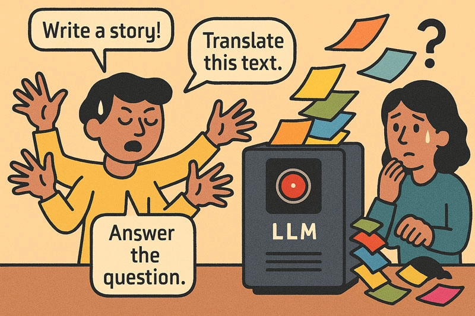
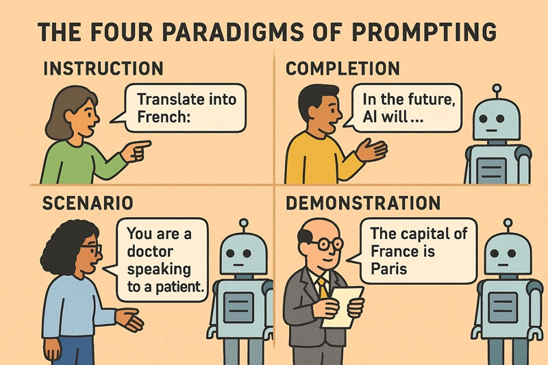

## Introduction

Large language models (LLMs) map sequences of text to other sequences of text. Given an input string, an LLM predicts the most probable continuation based on the statistical patterns it has learned during its training process. What makes LLMs remarkable is not merely their predictive capability, but the emergent behaviors they display across a wide range of tasks including

- *Correct spelling and punctuation*
- *Syntactic and grammatical structure*
- *Semantic understanding and paraphrasing*
- *Conversational coherence and dialogue flow*
- *Multilingual expression and translation*
- *Code generation and formal logic*
- *Question answering and knowledge retrieval*

We can use these capabilities to solve complex problems, but to do so effectively, we need to understand how to communicate with these models.

<!--more-->

### Podcast

If you prefer listening over reading, check out this podcast episode where the four prompting paradigms are explored in more detail.

<audio controls style="width:100%" preload="none">
  <source src="mastering_llms_podcast.mp3" type="audio/mpeg">
  Your browser does not support the audio element.
</audio>

## The Fragility of Model Behavior

At the heart of the prompt engineering challenge is the **sensitivity of LLMs to input phrasing**. Unlike traditional deterministic systems, LLMs do not "understand" tasks in the human sense; they generate the most statistically probable continuation of a given sequence. This makes their output highly sensitive to subtle changes in prompt design.

For instance, in instruction-based prompting, the difference between "Summarize this article" and "Write a short abstract" can cause the model to shift tone, structure, or depth of analysis. This brittleness necessitates a thoughtful and experimental approach to prompt construction.

Prompt engineering is therefore essential not only for eliciting correct outputs, but also for:

- Preventing **hallucinations**
- Enforcing **output structure**
- Ensuring **task fidelity**
- Aligning with **domain-specific requirements**

Each of the four paradigms offers unique affordances and constraints for prompt construction.

## Instruction-Based Prompting

Instruction prompting involves explicitly telling the model what to do, using imperative or directive phrasing. Examples include *"Summarize this article,"* or *"Translate the following sentence into French."*

### Strengths

- **Clarity and directness:** Instructions are easy for humans to craft and interpret, and often map cleanly to the task's intent.
- **Few-shot and zero-shot friendly:** With instruction-tuned models (e.g., [FLAN](https://github.com/google-research/FLAN) or [InstructGPT](https://openai.com/index/instruction-following/).), even zero-shot tasks can achieve reasonable performance.
- **Modularity:** Instructions can often be reused across inputs and domains.

### Weaknesses

- **Brittleness to phrasing:** Slight rewordings (*"Give a short summary"* vs. *"Write a brief abstract"*) can yield inconsistent outputs.
- **Reliance on fine-tuning:** Effectiveness depends heavily on whether the model has been trained on instruction-following tasks.
- **Limited control granularity:** Harder to enforce structural constraints, format adherence, or nuanced behavior without combining with demonstrations.

### Best Suited For

- General-purpose language tasks (summarization, translation, classification)
- Rapid prototyping and user-facing interfaces
- Environments where human oversight or trial-and-error is viable

### Prompt Engineering Tips

- **Avoid Ambiguity:**  
  *"Translate this text"* is weaker than *"Translate the following English sentence into formal French."*

- **Control Verbosity:**  
  *"Give a one-sentence summary"* vs. *"Summarize briefly in three bullet points."*

Well-crafted directives shift the model behavior with high precision - a powerful advantage in general-purpose applications. And don't be shy to write a paragraph or more to set the context, as LLMs can not handle complex instructions but also perform better with them.

## Completion-Based Prompting

Completion prompting leverages the model's pretrained behavior as a next-token predictor. It operates with minimal guidance, relying on the model's statistical predispositions. The prompt provides a partially written example or a sentence fragment, and the model is asked to continue.

For example:

> *"In the future, artificial intelligence will"*

prompts the model to extend the thought and without adding further context to the prompt, this could yield utopian, dystopian, or technical completions.

### Strengths

- **Natural alignment with model training:** Most LLMs are pretrained to predict the next token, making this method intuitive to them.
- **Creative and generative capacity:** Especially useful for open-ended writing, story generation, or brainstorming where ambiguity is desirable.
- **Lightweight and fast:** Minimal need for engineering or structure.

### Weaknesses

- **Poor task fidelity:** No explicit task definition means the model may generate plausible but irrelevant continuations.
- **Lack of determinism:** Hard to constrain output unless paired with post-processing or reranking.
- **Context-sensitivity:** Output can be sensitive to subtle variations in the prompt text or tone.

### Best Suited For

- Generative tasks (fiction writing, brainstorming, creative ideation)
- Rapid prototyping of open-ended dialogues
- Artistic and narrative domains where ambiguity is acceptable

### Prompt Engineering Tips

- **Tone Anchoring:**  
  *"In the future, artificial intelligence will likely transform healthcare by..."*

- **Structural Suggestion:**  
  *"Three likely effects of artificial intelligence in the future are:"*

Though indirect, our prompt engineering here *suggests a pattern* the model tends to follow-useful for both creative and informative generation.

## Scenario-Based Prompting

Scenario prompting constructs a frame of reference, often role-playing a situation. The model is provided with a simulated or hypothetical situation and asked to act within it.

Consider the difference between:

> *"You are a physician speaking to a patient about test results."*

vs.

> *"Tell me about test results."*

The former yields outputs grounded in empathy and domain specificity; the latter is far more ambiguous and can to generic or unwanted responses.

### Strengths

- **Role-play and persona simulation:** Models can embody roles with surprising fidelity, enabling simulated interviews, coaching, or role-specific behavior.
- **Contextual richness:** Scenario-based prompts allow rich world-building, which can unlock more nuanced and human-like responses.
- **Useful for embodied tasks:** Ideal for interactive agents, dialogue systems, or game design.

### Weaknesses

- **Prompt bloat:** Detailed scenarios can consume token limits, especially in long-form interactions.
- **Fuzzy boundaries:** If the scenario is not well-bounded, the model may "break character" or hallucinate inconsistencies.
- **Requires careful curation:** Crafting effective scenarios is a high-skill task requiring contextual insight.

### Best Suited For

- Simulated environments and dialogue agents
- Training agents with internal states (e.g., in reinforcement learning from human feedback)
- Tasks where emulated context or tone is crucial (e.g., counseling, negotiation)

### Prompt Engineering Tips

- **Persona Anchoring:**  
  "You are a compassionate pediatrician with 10 years of experience..."

- **Environmental Constraints:**  
  "You are in a courtroom explaining to a jury..."

Scenario-based prompting is ideal for dialog agents, educational tutors, or simulations.

## Demonstration-Based Prompting

Demonstration prompting - also known as Few-Shot Learning - relies on *pattern learning by example*. Even in few-shot settings, the model can learn and reproduce complex behaviors. This approach shows the model examples of the desired input-output behavior. For example:

    Input: The capital of France is  
    Output: Paris  
    Input: The capital of Germany is  
    Output:

With the above prompt, the model will likely respond with "Berlin" due to the learned pattern from the demonstrated input-output pairs.

### Strengths

- **Strong task adherence:** When examples are well-curated, models often closely follow the pattern.
- **Fine-grained control:** Demonstrations enable specification of output structure, formatting, tone, and even reasoning steps.
- **Adaptable to new domains:** Few-shot prompts allow domain-specific adaptation without full retraining.

### Weaknesses

- **Prompt length limitations:** Few-shot examples consume input space, limiting use for long documents or tasks.
- **Data curation overhead:** Quality and diversity of demonstrations strongly influence performance; bad examples degrade reliability.
- **Catastrophic overfitting (in fine-tuning):** Demonstration-based fine-tuning can result in over-anchoring to training distribution, reducing generalizability.

### Best Suited For

- Structured prediction tasks (information extraction, parsing)
- Scientific and technical QA
- Domains requiring format consistency or stylistic mimicry

### Prompt Engineering Tips

- **Diverse but Consistent Examples:**  
  Avoid overfitting while maintaining structural coherence.

- **Structural Explicitness:**  
  Use clear delimiters and I/O labels.

- **Salient Sequencing:**  
  Put hard or important examples first to frame expectations.

Demonstration prompting can greatly enhance accuracy in classification, information extraction, and reasoning tasks.

## Takeaways

### Strategic Prompt Design

Prompt engineering maximizes the effectiveness of LLMs through strategic prompt design. The four paradigms - **Instruction**, **Completion**, **Scenario**, and **Demonstration** - enable precise control over:

1. **Output Quality:**  
   Better results with minimal hallucination and clearer structure.

2. **Task Alignment:**  
   Prompts tailored to specific roles or formats.

3. **Statistical Affordances:**  
   Cooperation with model priors instead of resistance to them.

Prompt engineering is becoming a core literacy in AI interaction-a blend of linguistic design, experimentation, and systems thinking.

### Prompt Engineering is Human-AI Collaboration

Prompt engineering is not about "tricking" the model-it is about **collaborating with its statistical priors** to achieve a communicative goal.

Effective practitioners treat prompts as **programs with soft constraints**:

- Natural language becomes the "code"
- The model becomes the probabilistic interpreter

Success depends on iterative refinement, error analysis, and tuning language to match task and context.

### Prompt Engineering Trade-offs

Each method reflects a trade-off between generality, control, creativity, and effort. Instruction-based prompting offers a general-purpose interface with relatively low engineering cost, provided the model is instruction-tuned. Completion-based prompting maximizes fluency and open-endedness but lacks precision. Scenario-based prompting excels in conversational and contextual settings but requires careful design. Demonstration-based prompting, finally, offers the highest task specificity and reliability but at a higher cost in data preparation or prompt engineering.

From a systems design perspective, these methods are often composable. For example, a well-engineered prompt may begin with an instruction, embed a scenario, and then present demonstrations. Such composite prompts harness the strengths of multiple methods to produce more robust and controllable outputs.

## References

- OpenAI Cookbook [How to work with large language models](https://cookbook.openai.com/articles/how_to_work_with_large_language_models)
- Google Research [FLAN](https://github.com/google-research/FLAN)
- OpenAI [InstructGPT](https://openai.com/index/instruction-following/)
