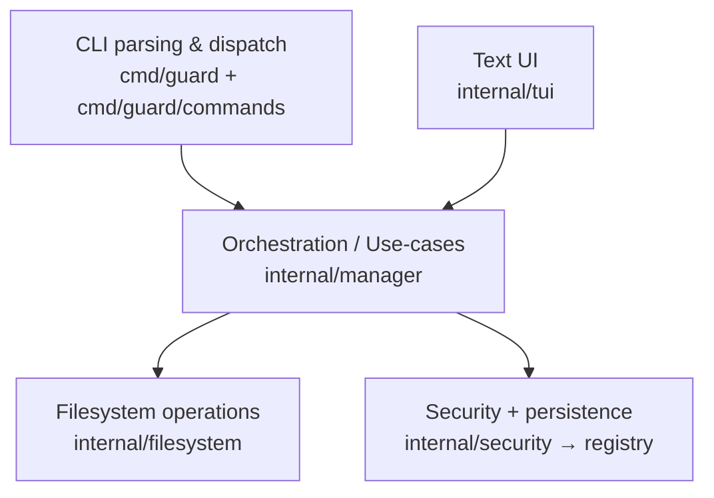
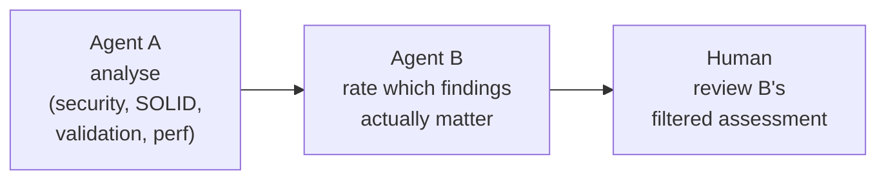
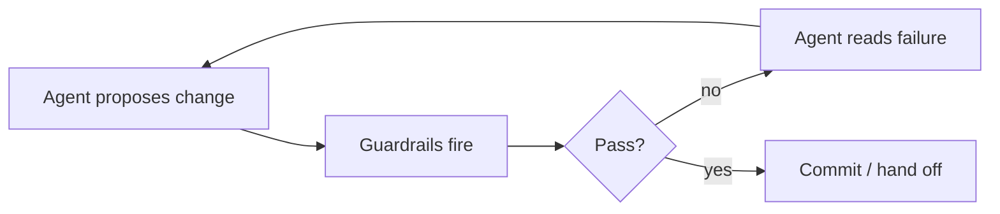

In early 2026, I set myself a goal that sounded irresponsible when I said it out loud: *stop reviewing ai generated code*. Not skim less, not just trust the agent, simply **don't review any code**, without compromising on the final result, the delivery of a working product.

At that time I didn't really know how it could be done but I was ready to try out a couple of different techniques. The first one was specification-driven development something I've read about a lot and saw many people talk about online. 


**The Hackathon Story**
I placed in the top ten at an international AWS AI Hackathon with
Guard, an open-source tool that protects files at the filesystem level
from unintended modifications by AI coding agents. In this article,
I'll share why I built Guard, how my attempt to use spec-driven
development ultimately failed, and how a different approach -
guardrail-driven development - saved the project and won me $1,000.



A few weeks later the AWS AI Hackathon hosted by [dynamous.ai](https://dynamous.ai) - built around Kiro, AWS's spec-first IDE - gave me a clean place to find out. Fixed deadline, fixed credit budget, a $17000 prize pool, and a rule that meant a meaningful share of the code had to be agent-generated. I shipped an open-source tool called **guard** - a terminal based program written in Golang, that protects files at the filesystem level from unintended modifications by AI coding agents - placed in the top ten internationally, and wrote almost no code by hand.

What got me there was the third thing I tried.

The first was specification-driven development. Tight requirements (R1, R2, R3…), handed to the agent, accepted if the spec was met. It didn't go well. The specifications looks great but the execution would always deviate from the specifications or make up requirements for things that were not specified tight enough. The attempt second was *more* specification: full tutorials with worked inputs and outputs. Same failure mode but with lower frequency. The third - the one that actually worked - was to take those tutorials and convert them into automated tests, and to take the architectural design and convert them into architectural unit tests. At first, the agent tried to modify testfiles that they were not supposed to. But when I write protected ("guarded") the tests so the agent could not silently rewrite them to make the build green. The agent had no choice but to fix the code and not the test. This approach is what allowed me to build guard in very short amount of time.

Building it raised four questions I want to work through here, in order:

1. How do we get rid of the review bottleneck without giving up control?
2. What is a sensible low-risk pathway to get there?
3. What are we giving up, and why does this feel uncomfortable at first?
4. Are these really new patterns in software, or just a recombination of things we already know?

I'll answer each one with what I learned from this single project. A sample size of one is a sample size of one - but the failure modes were specific enough, and the fix was concrete enough, that I think the shape is worth sharing.



**GPT Image**
I think I could've done a better job regarding image consistency in the comic to the left.



## 1. The Review Bottleneck


**The Bigger Question**
We'll use the story of the Hackathon project to think through a much
deeper question: How do we get rid of the review bottleneck without
giving up control? What is a sensible low-risk pathway to get there?
What trade-offs are we making in the process, and why does it feel so
uncomfortable at first? And finally, are these really new patterns in
software development? Or are we just seeing a recombination of known
principles and patterns?


Two numbers from Sonar's 2026 *State of Code Report* describe the situation precisely: 42% of code in surveyed codebases is now AI-generated, and only 48% of developers report that they validate all of it.[^sonar] (A separate finding in the same report - that 96% don't fully trust what the AI produces - is the emotional half of the same gap.) Forty-two percent generated, less than half validated. That is the review bottleneck expressed as a percentage.

The bottleneck is not that we don't have specs. We have *more* specs than ever - every issue tracker, design doc, and Slack thread is a spec of some flavour. The bottleneck is that humans cannot read every line of AI-generated code at the speed the AI now produces it. So we mostly don't. We skim, we accept the diff, and we move on. Which is fine until the agent has confidently described a function as "complete" while the test for that function silently fails.

That last failure mode has a specific feeling and, in my workflow, a specific phrase. The agent finishes, summarises what it did, and offers a polite "the implementation is now complete." You run the test suite. A test fails. You point this out. The agent replies:

> *"Yes, you are absolutely right!"*

And then it proposes a fix.

The phrase is the symptom. The disease is that the agent's *confidence* is decoupled from the agent's *correctness*. There is no honest signal coming back into the loop from the code itself, so the agent fills the silence with reassurance - and so do I, when I'm tired and the diff is large and the spec said something close enough to what got built.

The kinds of failure I am describing are mundane and easy to wave through one at a time. On this project, the patterns I saw repeatedly were:

- defaults that silently masked missing configuration (a config field absent → a sensible-looking default kicks in → the misconfiguration ships)
- fallback branches that hid the real failure rather than surfacing it (the network call fails → fallback returns an empty slice → the caller treats "no results" and "the upstream is down" as the same state)
- `log.Print(err)` followed by continuing anyway, as if logging the error were the same as handling it
- over-engineering a 30-line script into a small framework with three layers of indirection
- moving files between packages on every refactor, rotting the architecture by attrition

Any one of these is a small thing in a diff. Half a dozen of them in a 400-line change is a different conversation - and the model is patient, polite, and confident through every one of them.

My first instinct was to fix this with better specs. At the hackathon I wrote requirements that looked like this (excerpt, lightly cleaned):

```text
R1: The focused pane's title must be rendered with ItemSelected
    styling (blue bg, white fg).
R2: The inactive pane's title must retain default styling
    (bold white text, no background).
R3: Highlighting must update immediately when Tab is pressed,
    with no perceptible delay.
R4: Highlighting must not break the top border alignment -
    the junction character must remain aligned with the separator.
```

It survived planning. It did not survive implementation. The agent produced something that *looked* like it met R1–R4 in the screenshots it described; the actual behaviour drifted on R3 and broke R4 entirely. I caught some of it. I missed some of it. Some of it I waved through.

So I wrote a more elaborate spec: three full tutorials - one for single files, one for collections of files, one for the TUI - with inputs, outputs, and example sessions. Tutorial 1 began like the snippet below (the real version lives in `docs/TUTORIAL-1.md` of the Guard repo):

```bash
$ guard init 0644 root wheel
$ touch test.txt
$ guard add file test.txt

$ cat .guardfile
config:
    guard_mode: "0644"
files:
    - path: ./test.txt
      mode: "0644"
      guard: false

$ sudo guard toggle file test.txt
Guard enabled for test.txt
```

Tutorial 2 extended the same shape to *collections* - named groups of files where Guard had to handle shared membership, last-operation-wins on overlapping files, and conflict detection on ambiguous toggles:

```bash
$ guard create alice
$ guard update alice add alice1.txt alice2.txt shared.txt

$ guard show collection alice
[-] collection: alice (3 files)

$ sudo guard enable collection alice
Guard enabled for collection alice
Guard enabled for alice1.txt
Guard enabled for alice2.txt
Guard enabled for shared.txt
```

Tutorial 3 specified the TUI itself - because the most reliable way I know to pin down a terminal UI is to draw it in ASCII first, then build to the drawing:

```text
╔═ Files ═══════════════════════════════╤═ Collections ═════════════════╗
║                                       │                               ║
║ > docs                                │ [G] alice                     ║
║   [G] alice1.txt                      │ [-] bob                       ║
║   [G] alice2.txt                      │                               ║
║   [-] bob1.txt                        │                               ║
║   [G] shared.txt                      │                               ║
║                                       │                               ║
╠═══════════════════════════════════════╧═══════════════════════════════╣
║ ↑↓:Navigate  ←→:Expand  Space:Toggle  Tab:Switch  /:Search  Q:Quit    ║
╚═══════════════════════════════════════════════════════════════════════╝
```

A picture, but written in plain text - readable to a developer in onboarding, and readable to an agent as a target to build toward.

This was a better spec by every reasonable measure. It read like documentation a human would actually use. And it failed in the same way, just less often. The agent drifted; I ratified the drift.

That was the moment I stopped believing that the missing ingredient was *more* specification. The missing ingredient was something else: a *feedback loop the agent could not talk its way out of.*

---

## 2. A Low-Risk Pathway: Encode the Specs into the Environment

This is the longest chapter of the article, on purpose. The pathway has several moving parts - Guard itself, the kinds of guardrail that mattered, the hooks that keep the loop tight - and the rest of the essay assumes all of them are in place. If you want only the takeaway, the answer is at the end. If you want the answer to be *load-bearing*, read the middle.

The fix was not to throw the tutorials away. It was to take each one and re-encode it in a form the environment could enforce. The tutorials stayed, because humans needed them. But every claim a tutorial made about behaviour got mirrored in a test that ran on every change. Every architectural rule got mirrored in a linter or semgrep rule. And every test file got marked read-only so the agent could not "fix the build" by editing the assertions.

That last step - locking the tests - is what Guard does. The first version was literally two shell commands I ran by hand:

```bash
chmod -w tests/test-tui-search-001.sh
chflags uchg internal/security/path_validator.go
```

That snippet *is* the seed of the tool. The whole point of Guard is to make this kind of write-protection routine, reversible, declarative, and survivable across team members and refactors. The user-visible surface is small on purpose:

- a single `.guardfile` (a YAML registry of protected paths) per repo
- a CLI for guarding individual files
- a CLI for guarding collections of files (groups managed together)
- a TUI for accelerated workflows, with fuzzy search over the registry
- respect for both `.gitignore` and a custom `.guardignore`

The TUI shows each path's protection state with a single-character flag in front of it:

- `[G]` - **explicitly guarded**
- `[g]` - **implicitly guarded** (inherited from a collection)
- `[~]` - **mixed** (a folder where some children are guarded and some are not)
- `[-]` - **unguarded** (registered with Guard, protection currently off)
- `[ ]` - **not registered** (Guard does not yet know about this path)

The flags exist so the human eye (and the reviewing agent) can scan a directory and tell, instantly, what is and is not protected. But conceptually the whole tool is `chmod -w` with social proof.

Once the tests are locked, the environment can talk back honestly. The agent edits a file, the build runs, and the build either passes or it does not. Below are the six kinds of "talking back" that mattered most on this project - each catching a different family of mistake.

### Tutorials become shell tests

The tutorial step "register a file, then toggle the guard, then verify the permissions changed" becomes a shell test that runs the same commands and asserts on the outcomes. Excerpted from `tests/test-add-optional-keyword-001.sh` (the `assert_*`, `file_in_registry`, and `get_*` helpers are project-local, defined in `tests/helpers-cli.sh`):

```bash
test_add_positive() {
    # Setup
    $GUARD_BIN init 000 "$(get_current_user)" "$(get_current_group)"
    touch test1.txt
    local initial_perms=$(get_file_permissions "test1.txt")

    # Run
    $GUARD_BIN add test1.txt

    # Assert
    assert_exit_code $? 0 "guard add should succeed"
    file_in_registry "$(pwd)/test1.txt" \
        || fail "File not in registry"
    assert_equals "false" "$(get_guard_flag $(pwd)/test1.txt)"
    assert_equals "$initial_perms" "$(get_file_permissions test1.txt)"
}
```

The shell test and the tutorial share content but serve different readers. The tutorial is for the developer onboarding to the tool. The test is for the agent who has to make a change without breaking the tool's contract with that developer.

### Conventions become semgrep rules

The architecture document says: "the registry must only be loaded through the security layer; nothing else gets to call `registry.Load()` directly." That sentence is, on its own, a vibe - easy for an agent to politely ignore. The same sentence as a semgrep rule (excerpted from `.semgrep.yml` in the repo; message text trimmed for length) is enforced on every commit:

```yaml
- id: registry-load-restricted
  languages: [go]
  message: |
    Direct calls to registry.Load() are restricted to the
    security layer. All loads must go through Security, which
    performs path validation and tamper detection.
  severity: ERROR
  pattern: $REG.Load()
  paths:
    include:
      - "**/*.go"
    exclude:
      - "**/*_test.go"
      - "**/internal/security/security.go"
```

One rule. The boundary is now an error message instead of a hope.

### Linters compound

A single semgrep rule catches a single pattern. Linters compound across categories - each enabled check catches a different family of mistake, and the more checks you turn on, the smaller the surface the agent can drift across. The Guard project's `golangci-lint` config enables a focused stack:

```yaml
linters:
  enable:
    - errcheck       # unchecked errors
    - govet          # suspicious constructs
    - staticcheck    # bug patterns
    - ineffassign    # ineffective assignments
    - unused         # dead code
    - gosec          # security issues
    - revive         # style

issues:
  max-issues-per-linter: 0
  max-same-issues: 0
```

The two `0` lines at the bottom are not boilerplate. By default `golangci-lint` suppresses duplicate findings to spare the reader. With AI-generated code that default is exactly wrong: if a pattern is broken in one place, it tends to be broken in five, and seeing all five is what lets you turn the pattern into a rule rather than fixing it one instance at a time.

### Complexity has a cap

The other category that compounds quietly is complexity. Given a half-finished function, the next polite thing for an agent to do is add another branch rather than stop to refactor. Over a few days, the function that was supposed to be 30 lines is 300, with seven levels of nesting and a switch statement that no one wants to read. Complexity gates turn the build red the moment a single function crosses a threshold:

```bash
# Cyclomatic - branches through the function
gocyclo -over 50 .

# Cognitive - how hard the function is for a human (or agent) to read
gocognit -over 120 .
```

Two complementary metrics. Cyclomatic counts independent paths; cognitive penalises nesting, breaks in control flow, and recursion. The thresholds shown (50 and 120) are deliberately set at this project's *current baseline* rather than at the textbook target of around 15. A high-but-honest baseline that ratchets down over time is more useful than an aspirational one the team learns to suppress with `nolint` comments.

### Architecture becomes a unit test

The Guard architecture has a strict layering: CLI/TUI talks to a manager; the manager talks to filesystem and security/registry; nothing skips a layer. A picture of that contract sits in `docs/ARCHITECTURE.md`:



The picture is the contract. The *test* is what stops the agent from quietly relocating files between packages on the next refactor and rotting the architecture (a habit several agent families I worked with showed within minutes if no one was watching). From `internal/architecture/layers_test.go`:

```go
func TestLayering_NoTuiFilesystemImports(t *testing.T) {
    repo := repoRoot(t)
    tuiDir := filepath.Join(repo, "internal", "tui")
    forbidden := []string{"/internal/filesystem"}
    assertNoForbiddenStrings(t, tuiDir, forbidden)
}

func TestLayering_NoCliRegistryAccess(t *testing.T) {
    repo := repoRoot(t)
    cmdDir := filepath.Join(repo, "cmd", "guard", "commands")
    forbidden := []string{
        "GetRegistry(", "/internal/registry", "/internal/security",
    }
    assertNoForbiddenStrings(t, cmdDir, forbidden)
}
```

Each test asserts that one layer never imports something from a layer it is not allowed to touch. Once these tests are in place and locked, the agent can refactor freely *within* the rules; the moment it tries to cross a forbidden boundary, the build dies.

### The loop closes with hooks and CI

Four small pieces of plumbing make the loop tight enough that the agent feels the wall on every turn.

A pre-edit hook refuses direct writes to `.guardfile`. The agent that tries to "fix" a persistence bug by hand-editing the YAML registry gets stopped immediately. The hook reads the edit payload Claude sends on stdin and inspects the file path:

```bash
# .claude/hooks/block-guardfile.sh
INPUT=$(cat)
FILE_PATH=$(echo "$INPUT" | jq -r '.tool_input.file_path // empty')

if [[ "$FILE_PATH" == *.guardfile ]]; then
    echo "BLOCKED: Do not edit .guardfile directly." >&2
    exit 2
fi
```

A post-edit hook auto-formats Go files on every save, so style noise never reaches the diff:

```bash
# .claude/hooks/go-fmt.sh
INPUT=$(cat)
FILE_PATH=$(echo "$INPUT" | jq -r '.tool_input.file_path // empty')

if [[ "$FILE_PATH" == *.go ]]; then
    go fmt "$FILE_PATH" 2>/dev/null
fi
```

A `Stop` hook fires every time the agent thinks it is done, and runs the whole CI pipeline before the agent is allowed to stop talking. This is the single most important piece - it is what turns "guardrails exist" into "guardrails fire on every turn":

```json
{
  "hooks": {
    "Stop": [
      {
        "hooks": [
          { "type": "command", "command": "just ci-quiet" }
        ]
      }
    ]
  }
}
```

And a git pre-commit hook runs the same recipe before any change reaches the repo:

```bash
# .githooks/pre-commit
#!/bin/bash
just ci-quiet
```

Enable once with `git config core.hooksPath .githooks` and the commit is blocked if CI fails. In the Guard project, the single command `just ci-quiet` runs:

- `go fmt` (formatting)
- `golangci-lint run` (lint suite)
- `semgrep --config .semgrep.yml --error` (custom architectural rules)
- `gocyclo -over 50` (cyclomatic complexity gate)
- `gocognit -over 120` (cognitive complexity gate)
- `go test ./...` (unit tests)
- shell CLI tests and tmux-driven TUI tests

One line per stage. Pass means the agent can claim it is done; fail means the agent reads the failure on stdout and gets another turn.

### What mattered less than I expected: which model

I worked through the hackathon with more than one agent family - Claude Code through its CLI, the Kiro IDE's built-in agent, and a couple of others I used for shorter passes. The differences between models were real and showed up in characteristic ways: some followed the specs more tightly than others; some over-engineered more aggressively; "top tier" did not mean "best at every task" - what each was good at varied by domain and by prompt shape.

But the variable that actually decided whether the loop closed was not which model I picked. It was the *harness* the model ran inside. Claude Code's CLI gave me the tightest loop because every tool call could be intercepted by a hook and every Stop event could trigger CI; Kiro's IDE wrapped a similar-class model in heavier spec ceremony with fewer interception points. The same model behaved noticeably differently inside the two harnesses, and the harness with the tighter feedback loop won, every time.

The corollary is that "which AI should I use" is mostly the wrong question if the loop around the AI is loose. A weaker model in a tight loop beats a stronger model in a loose one - because the weaker model's mistakes are caught immediately, and the stronger model's mistakes are caught when they hit production.

These pieces stop being a quality programme run by the humans on Tuesdays and start being the *primary feedback channel* for the non-human collaborator that produces the bulk of the code.

---

## 3. What You Give Up - and What You Get

The first uncomfortable thing is dopamine. There is something satisfying about reading a diff line by line, catching a bug, and feeling like you earned the commit. Guardrail-driven development takes that ritual away. You spend more time writing tests and rules, and less time being clever in code review. The first week feels less productive even when the throughput numbers say otherwise.

The second uncomfortable thing is *visible* control. When you read every line, you can at least *believe* you understood the change. When the environment vets the change for you, you understand the *contract* the change has to satisfy, but you do not personally inspect each line. Some of that belief was always overstated - you were not really catching every issue at speed - but the comfort was real.

What you get back is more honest signal. Guardrails do not get tired at 11 p.m. They do not skim the second half of a 600-line diff. They do not nod along when an agent says "yes, you are absolutely right." If a layering rule is violated, the build is red. If a registry load skips the security layer, the build is red. If a tutorial's stated behaviour breaks, the test is red. Review attention is freed up to spend on the things only a human can judge: is this the right feature, is this the right scope, does this design hold up against the next three feature requests.

The pattern is older than agentic coding. I learned it defending petabyte-scale search and storage systems from *human* contributors - when the throughput of changes exceeds the throughput of careful reading, you stop relying on the careful reading and start relying on the environment. Humans drift. Environments don't. The novelty in 2026 is that the throughput of changes has crossed that line for a much smaller class of project than it used to.

The shift, summarised:

- I stopped reviewing code.
- I started reviewing behaviour and AI-generated reports.
- Every miss became a new test or a new guardrail.

This is also where I want to be explicit about the limits. There are categories of change where I would still want human eyes on the lines: novel cryptographic code, irreversible data migrations, anything that crosses a trust boundary into a customer's environment, and architectural shifts where there is no prior rule to encode yet. Guardrails are excellent at *enforcing* a captured rule. They are not the right tool for *discovering* a rule that does not yet exist. For that, you still need a person willing to read carefully and a culture willing to slow down.

The honest test is whether the agent's "yes, you are absolutely right" stops being a polite filler and starts being a real acknowledgment of something the *environment* has just told it. On this project, it did. That is the closest thing I have to evidence that the approach worked.

---

## 4. Old Patterns, New Pressure

The fourth question is the one I find most interesting, and the one I am most calibrated about: are any of these patterns actually new?

What's new is the loop frequency they have to support. The patterns themselves are mostly old.

Tests as executable specs are TDD. Architectural rules enforced by tests are the fitness-functions idea from evolutionary architecture. Linters, formatters, and semgrep are decades-old static analysis. Pre-commit hooks have been in `core.hooksPath` since forever. Cyclomatic complexity thresholds are McCabe in the 1970s. Pyramids of validation layers are how we have drawn quality programmes since at least the early ATDD literature. Even "lock the tests so the implementer cannot edit them" has a long history in safety-critical software and in interview-grading systems.

The stack does not change much. The frequency at which it has to fire changes by an order of magnitude. These tools were designed for a world where the bottleneck was human typing speed and the cost of running a check was non-trivial. Now the bottleneck is human reading speed and the cost of running a check is near-zero on every edit. Most of the engineering work in 2026 is in tightening the loop, not in inventing new tools.

The integrating picture I have ended up using is the *AI validation pyramid*. The human sits at the tip; below them, in increasing automation, are AI-assisted reviews, then deterministic checks (tests, linters, semgrep, complexity gates), then the agent's own iteration loop. Each layer absorbs the noise the layer below cannot, so the human's time is spent only on signal the lower layers cannot produce.


Three consequences fall out of this picture, all worth stating plainly.

### Code itself is context

Whatever the agent reads while making a change becomes part of what it predicts next. Internal code quality is therefore not an aesthetic preference; it is the substrate of the next suggestion. Tests, well-named functions, and architectural clarity are now cheap-to-buy speedups for the agent, not just gifts to the next human reader. The corollary is uncomfortable: a codebase that has accreted a layer of "we'll clean this up later" smell now slows the agent down on every edit, because the agent reads the smell as the local convention and produces more of it.

### External and internal validation are not substitutes

This is where I want to be explicit about a distinction most teams elide. *External* validation answers "does the code behave correctly?" - shell tests, unit tests, integration tests, end-to-end tests. *Internal* validation answers "is the code well-structured?" - linters, layer tests, complexity gates, semgrep rules, architectural unit tests. The two rings live on different sides of the same loop, and they are not interchangeable:

- Behaviour-only validation gives you a green test suite on top of fragile, illegible code. The next change is risky because nobody (human or agent) can reason about what is safe to touch.
- Structure-only validation gives you elegant, well-layered code that does the wrong thing. The architecture is pristine and the user is angry.

The loop needs both rings active on every change. The argument for guardrail-driven development is not "internal validation replaces external validation" - it is "the human cost of running both rings simultaneously, on every edit, has finally dropped to zero, so do it."

### AI-assisted review works best as two agents in series

The top of the pyramid still has a human, but the layer immediately below it has changed. AI-assisted review works best as a *two-agent* pattern. One agent runs a structured analysis (security, SOLID smells, input validation, performance). A second agent rates which findings are actually load-bearing and which are noise. The human reads the second agent's filtered assessment.

This pattern is sketched in the [ai-guardrails](https://github.com/florianbuetow/ai-guardrails) repo as a set of small "skills" - each one a prompt plus a checklist. In my workflow on the Guard project, this triage cut the per-change review surface noticeably, though I have not measured it formally enough to put a number on it.



A handful of single-purpose review skills sit alongside the triage agents and run on noisier passes:

- **Beyond SOLID Principles** - structural sanity (coupling, cohesion, single responsibility, depth of hierarchy)
- **Archibald** - architecture review (boundary conformance, dependency direction, layer integrity)
- **Security Review** - adversarial assumptions (what an attacker would try given this change)
- **Adversarial Review** - "try to crash your own software" (input fuzzing, edge cases, resource exhaustion, race conditions)

Each is just a prompt and a checklist. The value is that the checklists are *codified* and applied uniformly to every change, not pulled from memory by a tired reviewer on a Friday afternoon.

### Why the loop closes

The loop that all of the above is in service of is small and unglamorous:



Software engineers have been drawing exactly this picture since the early CI literature. The novelty in 2026 is that the loop now closes *without a human standing inside it.* The environment closes it. The agent self-corrects when the environment talks back. That is the whole unlock.

### How to start

If you want a single feature on which to try the loop and see whether it tightens for you, the shortest honest recipe I can give is five steps:

1. **Document expected behaviour** as a tutorial with worked inputs and outputs.
2. **Document the architectural rule** the feature must not break.
3. **Convert** both into automated checks - a shell or unit test for the behaviour, a layer test or semgrep rule for the architecture.
4. **Lock the tests** so the agent cannot silently relax them, and wire a CI command into a `Stop` hook so every turn ends with the build either green or honestly red.
5. **Treat every miss as a missing rule** - the moment something slips through, the response is "add a check" rather than "remember to look harder next time."

---

## Closing

Four questions, four short answers, in the order I asked them:

- *How do we get rid of the review bottleneck without giving up control?* We let the environment do the parts of review that the environment can do, and we spend our remaining attention on intent, behaviour, and scope.
- *What is a sensible low-risk pathway?* Start with one feature, not the whole codebase. The cost of the first guardrail is much higher than the cost of the tenth; the value compounds the other way round.
- *What are we giving up?* The dopamine of line-by-line review, and the comforting illusion that we were always catching everything. In exchange, we get an honest signal on every change.
- *Are these really new patterns?* No. They are TDD, fitness functions, linters, hooks, and pyramids - under more pressure than they were ever designed for, doing more work than they ever used to.

When an AI tells you "yes, you are absolutely right," the spec was not the problem. Your feedback loop was. Build the loop, and the agent stops needing to be polite.

---

[Comment on LinkedIn](LINK_TO_BE_ADDED)

## References

- [Guard - filesystem-level write protection for AI coding agents](https://github.com/florianbuetow/guard)
- [ai-guardrails - skills and review patterns](https://github.com/florianbuetow/ai-guardrails)
- [Sonar 2026 State of Code Report - Critical Verification Gap in AI Coding](https://www.sonarsource.com/company/press-releases/sonar-data-reveals-critical-verification-gap-in-ai-coding/)

[^sonar]: Sonar, *2026 State of Code Report*, "Sonar Data Reveals Critical Verification Gap in AI Coding". https://www.sonarsource.com/company/press-releases/sonar-data-reveals-critical-verification-gap-in-ai-coding/
