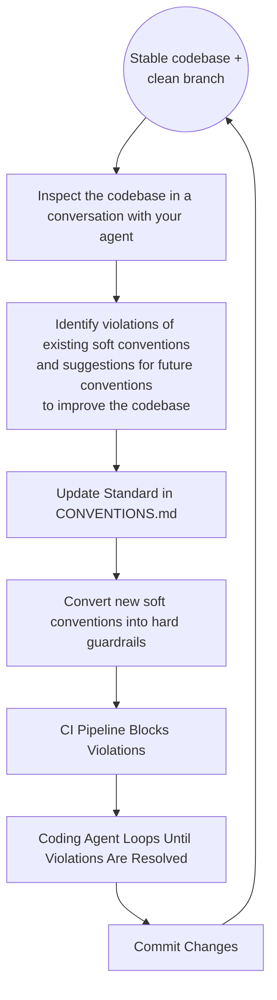

A high-signal codebase is one where code communicates intent, architecture, and logic with absolute clarity and minimizes clutter that makes the code harder to read, understand, or change.

Codebase quality often degrades not because of a lack of effort, but because soft conventions in markdown files are easily lost in context or simply ignored by your AI, which is trying to rush to a finish line to complete a task.

In this discussion I'm going to refer to `CONVENTIONS.md` As the file that encodes your project's ways of working, rules and conventions. For you, that could be encoded in entirely other files such as `README.md`, `AGENTS.md` or  any other file you chose. The point is that you should have a file that encodes these rules in natural language text / prompts also known as soft guardrails. 

Deterministic checks that enforce coding standards and project rules, blocking changes that violate things like formatting, architecture boundaries, complexity limits, or security policies. They can be used as feedback to agents, automatically guiding them to adjust their changes.

To prevent AI from ignoring them, you must turn them into **hard guardrails**, or at least as many as you can, because some of them are really difficult to translate into a deterministic check to detect a violation.

In this post, I will walk you through a recent session I had with my Gemini CLI agent, to discover violations of existing conventions and provide suggestions for adding new rules to improve the code quality. As you will see, this is a simple process, including the conversion of the new rules into hard guardrails.

## Step 1: Converse with the Agent

Starting from a stable code base and a clean branch, the first step is to converse with your agent to inspect the codebase for violations against the `CONVENTIONS.md` file, and to ask the agent how the codebase could structurally be improved regarding tests, code, and architecture. It started with a simple investigative prompt. I asked the agent to look for violations of our project's core mandates. Specifically, we have a strict rule: **"Never use environment variables for configuration."**

The agent quickly surfaced several offenders:
* `scripts/summarize-transcripts.py` was using `os.environ.get("CHANNEL_FILTER")`.
* `scripts/status.py` was checking `os.environ.get("SHOW_TIME")`.
* `scripts/config.sh` (our central shell config) was using the `${VAR:-default}` pattern for everything from verbosity to silence thresholds.

We also found that our **Error Handling** policy: which requires scripts to continue processing remaining items even if one fails: was being ignored in `scripts/transcribe_audio.py`. That script would `return 1` and abort the entire batch on the first error.

## Step 2: Defining the "Golden Path"

Before you can enforce a rule, you must document the correct way to follow it. We updated our `CONVENTIONS.md` to include concrete implementation patterns.

By providing a 'Golden Path,' you reduce the friction of compliance. Developers are much more likely to follow a rule if they have a copy-pasteable example of the right way to do it.

### The New Standard for Configuration
Instead of just saying "don't use env vars," we documented how to use our `Config` class and how to extract values in shell scripts:

```bash
# The new pattern for Shell scripts
DATA_DIR=$(uv run python -c "
import yaml
config = yaml.safe_load(open('config/config.yaml'))
print(config['paths']['data_dir'])
")
```

### The New Standard for Error Handling
We provided a snippet that ensures resiliency:

```python
failures = []
for item in items:
    try:
        process(item)
    except Exception as e:
        logger.error(f"Failed to process {item}: {e}")
        failures.append((item, str(e)))

if failures:
    # Report summary and then exit
    sys.exit(1)
```

## Step 3: Implementing the Guardrails

With the standards defined, we implemented two layers of automated enforcement.

### 1. Python API Banning with Ruff
Ruff is incredibly fast and provides immediate IDE feedback. We added a `banned-api` section to our `pyproject.toml` to catch direct environment access.

```toml
[tool.ruff.lint.flake8-tidy-imports.banned-api]
"os.environ".msg = """\
Convention Violation: Environment variables are forbidden for \
configuration. Please read CONVENTIONS.md to learn how to do it correctly \
."""
"os.getenv".msg = """\
Convention Violation: Environment variables are forbidden for \
configuration. Please read CONVENTIONS.md to learn how to do it correctly \
."""
```

### 2. Semantic Analysis with Semgrep
For more complex patterns: like shell scripts or loop structures: we used **Semgrep**. We created a new rule file `config/semgrep/convention-violations.yml`.

Semgrep allows you to write rules using the syntax of the language you are targeting, making it much more powerful than simple regex for finding structural violations.

```yaml
rules:
  - id: xrag.no-env-vars-shell
    languages: [bash]
    severity: ERROR
    message: >-
      Convention Violation: Shell scripts must not rely on environment
      variables for configuration. Please read CONVENTIONS.md to learn how
      to do it correctly.
    patterns:
      - pattern-either:
          - pattern: ${$VAR:-...}
          - pattern: ${$VAR}
      - metavariable-regex:
          metavariable: $VAR
          regex: "^[A-Z][A-Z0-9_]*$"
```

## Step 4: Verifying the Enforcement

The moment of truth came when we ran our CI pipeline (`just ci`). The guardrails worked exactly as intended.

### Ruff Catching Python Violations:
```text
TID251 `os.environ` is banned: Convention Violation: Environment variables
  are forbidden for configuration. Please read CONVENTIONS.md to learn how
  to do it correctly.
   --> scripts/status.py:287:34
    |
287 |     show_time = _parse_bool_flag(os.environ.get("SHOW_TIME"))
    |                                  ^^^^^^^^^^
```

### Semgrep Catching Shell Violations:
```text
scripts/archive-videos.sh
   ❯❯❱ config.semgrep.xrag.no-env-vars-shell
          Convention Violation: Shell scripts must not rely on environment
          variables for configuration.
          Please read CONVENTIONS.md to learn how to do it correctly.


           11┆ mkdir -p "$ARCHIVE_VIDEOS_DIR"
```

## Summary

Steps to maintain a high-signal codebase by turning soft conventions into hard guardrails.



You don't have to use this exact file name. You can use your README.md, AGENTS.md or whichever file(s) encodes the rules and conventions for your project.

Each cycle starts from a stable codebase with no uncommitted changes. You open a conversation with your agent and ask it to inspect the codebase against your `CONVENTIONS.md`, and to suggest structural improvements across tests, code, and architecture. The agent identifies both existing violations and opportunities for new conventions. You document those findings as concrete standards in `CONVENTIONS.md`, complete with golden-path examples that make compliance easy to follow. You then convert each new convention into a hard guardrail using tools like Ruff or Semgrep, wired into CI. When CI runs, it blocks any code that violates the rules and points developers directly to the documentation. The coding agent reads the failure output and loops, fixing violations, until all checks pass. You commit the result, and the codebase is stable again. The next time you are ready, you start from the top.

## Conclusion

By moving from soft documentation to hard automated rules, we have achieved several things: we reduced the cognitive load not only on developers who might read it but also for AI agents. We guaranteed deterministic quality for issues we've found so they cannot be repeated. And we've created a system that provides actionable feedback that points directly to the documentation to enable agents to auto-correct their changes.

## How to get started

To get started with a set of predefined guardrails for your project, you can bootstrap a sensible guardrails setup easily with my open-source [AI Guardrails](https://github.com/florianbuetow/ai-guardrails). And then refine it with the process discussed in this article. It currently supports Python, Java, Go, Elixir, C++, and Rust.


## Resources


[Semgrep Documentation](https://semgrep.dev/docs/) | Write code-aware static analysis rules using the syntax of the target language.
[AI Guardrails](https://github.com/florianbuetow/ai-guardrails) | Project templates for C++, Elixir, Go, Java, Python, and Rust with a rich set of automatic guardrails for AI coding agents.



