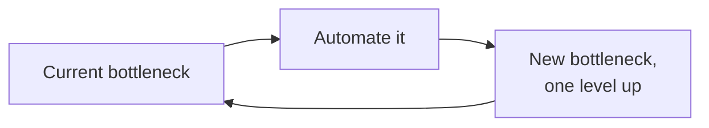
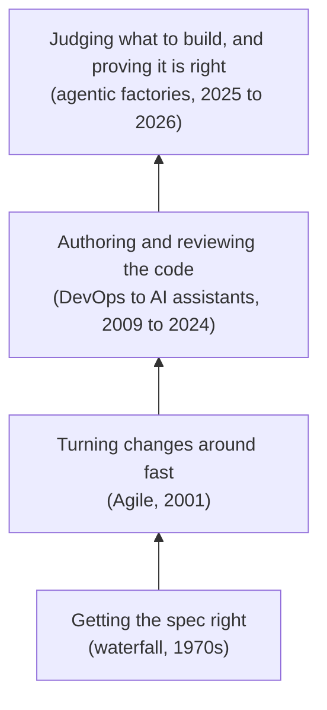

Somewhere in production right now, a security company called StrongDM ships software under two rules: no human writes the code, and no human reviews it. People write the specifications, curate the test scenarios, and watch the scores. Agents do the rest.


**Dark factory:** the term is borrowed from lights-out manufacturing, a plant that runs with no humans on the floor and therefore no lights. Applied to software, it describes a pipeline where agents write and check the code and humans never read it.


It is tempting to read that as a rupture, the moment the profession finally automates itself out of existence. Two details argue against the drama. The phrase StrongDM uses for the setup, "software factory," is more than twenty years old: Microsoft was shipping software factories in the mid-2000s, model-driven toolkits that assembled applications from templates and domain-specific languages, before the iPhone existed. And the obituary recurs on a schedule. The developer and author Dave Farley has pointed out the annual ritual: in 2023, GitHub Copilot would replace engineers within a year; in 2024, the same was said of the next tool; in 2025, of the one after that. The prediction keeps being wrong and keeps being made, which usually means it is pointing at something real and describing it badly.

So it is worth being precise about what has actually changed and what only feels new. The honest version is neither "this is the end of programming" nor "nothing is different." Software engineering has spent more than half a century moving a single bottleneck around, and this wave is moving it to the one place it has never quite reached: human judgment.

## What Every Wave Has in Common

Strip away the tooling and each era did the same structural thing. It automated whatever was the slowest, most expensive step at the time, and in doing so exposed a new slowest step one level up. The bottleneck did not disappear. It moved.

You can track the movement with one number: the length of the feedback loop, the time between making a decision and finding out whether it was right. The arc of the field is that number shrinking, from years to minutes, while the human role climbs to stay ahead of it, away from mechanical work and toward judgment.

That loop has run several times, and the latest turn is not a different machine, just the same machine reaching a higher rung. The fastest way to see it is to walk the turns.

## Half a Century of Moving the Bottleneck

| Era | Feedback loop | What got automated | Where the bottleneck moved |
|---|---|---|---|
| Waterfall (1970s) | Months to years | Almost nothing; the process was the tool | Discovering the spec was wrong, far too late |
| Iterative and model-driven factories (1980s to 2000s) | Weeks to months | Boilerplate, from formal models and templates | Producing the formal models by hand |
| Agile (2001) | Days to weeks | The big upfront specification | Team throughput: how fast you can turn changes |
| DevOps and CI/CD (around 2009) | Minutes to hours | Integration, testing, deployment | Authoring and reviewing the changes themselves |
| AI assistants (2021 to 2024) | Seconds, per function | Typing: boilerplate, tests, lookups | Unchanged at the macro level; still human authoring |
| Agentic factories (2025 to 2026) | Minutes, per feature | Authoring and local verification of whole changes | Specification, verification, and governance |

The table compresses four reactions to a single problem. Each is worth seeing as a move in the same game.

### Waterfall: the loop was the project

In the waterfall era the loop *was* the project. Winston Royce's 1970 paper, the one usually blamed for the model, actually warned against running the phases strictly once through, but the strict version is what the industry adopted. Requirements, then design, then implementation, then testing, each phase signed off before the next began. A working system often appeared only near the end, which meant the bottleneck was the months or years between writing a specification and discovering, during integration, that it described the wrong product.

The cost of being wrong, discovered late, set the agenda for everything after. When a defect found in system testing could force rework all the way back through design and requirements, the rational response was to make the feedback loop shorter so that being wrong would cost less. Every methodology that followed is, at bottom, an argument about how to find out sooner.

### The iterative correction

The first answers shrank the batch. Through the 1980s and 1990s, the Spiral model, Rapid Application Development, and the Unified Process broke the single long pass into a series of smaller ones, each delivering a partial but running system and each surfacing mistakes while they were still cheap to fix. A risk that would have sunk a waterfall project at month eighteen now showed up at the end of an increment, when there was still room to change course.


**Model-driven engineering:** an approach that treats high-level models, often expressed in domain-specific languages, as the primary artifact, and generates code and configuration from them. It dates to the 1980s and 1990s and required precise, formal inputs.


In parallel, a different idea was raising the level of abstraction itself. Model-driven engineering treated high-level models, rather than source code, as the thing you authored, and generated the implementation from them. Microsoft gave the pattern its now-familiar name in the mid-2000s, shipping software factories: collections of domain-specific languages, templates, and guidance packaged inside Visual Studio to assemble applications in a given domain. This is the part of the history where the "nothing is new" reading overreaches, and where being precise matters most. Those early factories were continuous with today's in *theme*, not in *capability*. They expanded templates from formal models that a human had to write precisely. They could not read an ambiguous request, reason about an unfamiliar codebase, or repair their own output. The vocabulary recurs. The capability does not. Holding both of those in mind at once is the only way to read the present accurately.

### Agile: the loop drops to weeks

In 2001 the Agile Manifesto crystallized a shift that had been building for a decade: away from heavyweight, plan-driven process and toward short iterations with frequent feedback. Scrum, Extreme Programming, and Kanban replaced the big upfront specification with a backlog of prioritized stories that could change every week, and they pushed practices, automated tests, continuous refactoring, collective ownership, that kept a codebase malleable enough to absorb that change.

The effect on the bottleneck was specific. When the specification stopped being a fixed document agreed up front and became a living queue, the constraint was no longer "did we get the spec right at the start." It became team throughput: how fast a cross-functional group could turn a change and learn from it. The work had moved up a level, from getting the requirements correct in advance to maximizing the rate of correction. And the cross-functional ownership Agile encouraged, developers and testers and increasingly operators sharing responsibility for delivery, laid the cultural groundwork for what came next.

### DevOps and CI/CD: the loop drops to minutes

Around 2009, DevOps tore down the wall between the people who wrote software and the people who ran it. Continuous integration made merging a routine, low-friction event that happened many times a day instead of a terrifying one that happened at the end. Continuous delivery kept every build deployable; continuous deployment pushed passing builds to production automatically, cushioned by feature flags, blue-green releases, and automated rollback. Shipping, once a project milestone with its own war room, became a nonevent. None of this was purely technical: DevOps was as much a cultural change as a toolchain one, with shared ownership and blameless postmortems replacing the old habit of throwing releases over a wall.

With integration and deployment automated almost out of existence, the slowest remaining step was the one nobody had touched: a human authoring the change and another human reviewing it. The most industrialized organizations responded by treating the pipeline itself as a product, standing up platform engineering teams to provide paved roads and golden paths so application teams could move without rebuilding the machinery each time. That instinct, to treat the delivery substrate as a first-class product rather than as plumbing, matters later, because it is exactly the instinct that lets an organization treat a fleet of agents as a platform component rather than as a novelty.

Four reactions, one motion. Each shortened the loop and pushed the bottleneck up a rung, from getting the spec right, to team throughput, to the act of authoring and reviewing changes. At every step the human moved further from mechanism and closer to judgment. Then the assistants arrived, and for a moment it looked as if the pattern might finally break.

## The Evidence Is Mixed, and That Is the Evidence

The AI assistant era is where the pattern looked, briefly, like it might snap. GitHub Copilot and Cursor shrank the innermost loop, the seconds it takes to write a function, close to zero, and it was reasonable to expect the macro loop to collapse next. It did not, and the productivity evidence is how we know.

The early numbers were spectacular and slightly misleading. A controlled study from GitHub, published in 2023, found developers completing a self-contained JavaScript task about 55% faster with Copilot than without. That is a very large effect, but it is also a single, contained task in a lab, the kind of work that flatters autocomplete and looks nothing like changing a mature system under real constraints.


**The METR study:** a randomized controlled trial run by METR in early 2025. 16 experienced open-source developers, 246 real tasks on mature repositories, using primarily Cursor Pro with Claude 3.5 and 3.7 Sonnet. Published July 2025.


The sharpest result on the other side comes from a randomized trial by the research group METR. Experienced developers, working on large codebases they knew well, were measured with and without AI tools. Beforehand they forecast that AI would make them about 24% faster. Afterward they believed it had made them about 20% faster. Measured against the clock, they were 19% *slower* with the tools than without. The gap between perceived and actual is the part worth keeping: the tools felt like a speedup even when they were a slowdown. METR was careful to add that this is a snapshot of one population at one moment, and that the number will move as models and habits improve. It is a warning against extrapolating in either direction, not proof that AI coding is overhyped.

Between those two poles, the field's evidence varies sharply with who is measuring and how. The headline numbers are only readable next to their provenance:

| Study (year) | What it measured | Finding | Evidence tier |
|---|---|---|---|
| GitHub / Peng et al. (2023) | One self-contained task, with vs without Copilot | ~55% faster | Controlled lab task |
| METR (2025) | Experienced devs on mature repos, with vs without AI | 19% slower, though they expected to be faster | Randomized trial, preprint |
| Daniotti et al., *Science* (2026) | ~160,000 developers, observational | ~3.6% more output; gains concentrated in seniors | Peer-reviewed |
| McKinsey (2023) | Task-level time trials | Large savings on routine tasks, small on complex ones | Consultancy report |
| Uplevel (2024) | ~800 developers, telemetry | No throughput gain; more bugs | Industry telemetry study |
| GitClear (2024) | Hundreds of millions of changed lines | Refactoring down, code duplication up | Vendor analysis (code-quality tooling) |
| DORA (2024 to 2025) | Broad practitioner survey | AI amplifies existing strengths and weaknesses | Industry research program |

The tiers matter. The peer-reviewed diffusion study and the preprint trial point the same way, that gains are real but concentrated in experienced engineers, while the lab result sits at the optimistic extreme and the consultancy's and vendor's figures each carry an interest worth naming. The most useful single finding is DORA's: AI does not deliver a uniform boost, it amplifies whatever an organization already is. Teams with strong automated testing, small batches, and robust platforms get faster; brittle, tightly coupled ones get less, and sometimes regress.

Read together, the shape is consistent and unglamorous. The assistant era sped up the typing and left the judgment untouched. The bottleneck did not move. It just became harder to ignore, because the slow part now was deciding what is correct and keeping the system coherent, and no tool was doing that.

There was a structural reason the gains stayed small, beyond any single tool. The assistant era changed what happened inside a developer's editor and left everything around it untouched. Work still arrived as tickets in a backlog, moved through sprints, went out as pull requests, waited on human code review, and shipped through the same pipeline. An engineer could draft a function in seconds, but that function still queued behind the same review, the same approvals, the same release process. Shrinking the innermost loop does little when the loop that governs delivery sits three levels up and does not move. Some senior engineers noticed the mismatch and turned the suggestions off, finding that a stream of plausible, low-precision completions cost more in attention than it saved in keystrokes. The tooling sped up the typing; the organization around the typing kept its old shape.

## The Move to the Judgment Layer

What changed in 2025 and 2026 is that the agents stopped suggesting and started finishing. Given an intent, a modern coding agent will plan, edit across dozens of files, run the test suite, read the failures, and iterate until the local checks pass. That is the macro loop, the one Agile and DevOps shortened but never automated, now running without a human standing inside it.

The concrete examples arrived faster than the vocabulary for them. Cognition's Devin was marketed as the first AI software engineer; OpenHands made the same idea open source; Factory's agents, and the agentic modes inside Cursor and Copilot, took high-level intents and returned whole change sets. The marketing outran the benchmarks, Devin resolved under fifteen percent of a standard set of real GitHub issues end to end, and the gap between a clean demo and a messy production ticket stayed wide. But the direction was unmistakable, and some teams pushed it to the edge. People began describing a five-level scale of AI assistance, with the dark factory as the top rung, level five, borrowed straight from manufacturing's lights-out plants.

StrongDM's factory is the documented extreme: agents write and check the code under the two rules, and humans never read it. The hard part there is no longer writing the code but trusting it without reading it. The answer is to judge behavior rather than lines: agents are scored against large libraries of simulated scenarios, run on cloned copies of the services the software integrates with, and a change ships only when its pass rate clears a bar. The economics are as striking as the engineering. StrongDM's team works to a heuristic that if it is not spending on the order of a thousand dollars per engineer per day on model tokens, the factory is underusing its capacity, an almost perfect inversion of the old assumption that human time was the scarce input and compute was free. A 2026 analysis from Stanford Law put the uncomfortable question plainly: built by agents, tested by agents, trusted by whom?

This is where the bottleneck finally arrives at the place automation has been pushing it toward for more than fifty years: human judgment about what to build and how to know it is right. When no one writes or reads the code, the human's job narrows to three things: specifying the intent precisely enough to be executable, designing the verification that decides whether it was met, and owning the consequences when it is not. Every prior wave stopped one rung short of that layer. This one is standing on it.

## The Strongest Objection

The thesis so far says the bottleneck always relocates and never vanishes. The strongest objection is that this time it might. If an agent can also write the specification, design the verification, and weigh the tradeoffs, then judgment is not a new bottleneck one level up. It is just the next thing to automate, and the line keeps moving until it reaches zero. This is not a straw man. It is the actual bet behind the most aggressive factories.

Two things make me hold the line, and I want to state them as calibration rather than confidence. First, the part of judgment that resists automation is not deciding in the abstract but being accountable. When an autonomous change escalates a privilege or leaks customer data, responsibility does not transfer to a model provider, and no current legal framework lets it. Someone has to own the outcome, and ownership is not a task you can delegate to an agent. Second, the evidence so far shows the work relocating rather than disappearing: senior engineers orchestrating, junior engineers not yet measurably benefiting, verification becoming the scarce skill. If that pattern breaks, the thesis breaks with it. For now it is holding.

## Where the Work Goes Next

That makes specification, verification, and governance the live frontier, and none of the three is solved. The pattern predicts as much: if the bottleneck has reached the judgment layer, the disciplines that serve judgment, how you state intent, how you check it, and who answers for the result, are where the next decade of tooling and process will concentrate. Each is already heading somewhere specific.

### Specification becomes the source code

If agents write the implementation, the durable artifact is no longer the code; it is the intent the code was generated from. That promotes specification from a document you write once and abandon to the thing under version control that actually defines the system. The assistant era already taught the hard lesson here: writing *more* prose specification tends to make agents drift, not comply, because prose is ambiguous and an agent will resolve the ambiguity in whatever direction is easiest. The trajectory is toward specifications that are executable rather than merely readable, a convergence of structured natural language, property-based tests, and selective formal methods, so that the spec can be checked against the system instead of trusted on faith. How to do that well is its own discipline, and an unsolved one; what is clear is that the scarce skill is shifting from writing code to writing the spec that code is held to. In practice that elevates prompts and specifications to versioned, reviewed artifacts in their own right, held to the standard the industry already applies to code and infrastructure rather than treated as disposable chat. It also pulls formal methods, long admired and little used because they were too expensive to write by hand, back within reach, since an agent can help draft and maintain the properties a human only has to approve. The organizations that learn to express executable intent well will, in effect, have automated the part everyone else is still doing by hand.

### Verification becomes the next bottleneck

Push authoring onto agents and the binding constraint becomes the oldest unglamorous question in engineering: how do you trust output you did not read. The naive metric, raw line or branch coverage, gets less useful exactly when code volume explodes, because covering more lines of machine-generated code tells you little about whether the risky paths are right. The move already underway is toward risk-weighted verification, concentrating scrutiny on the places where being wrong is expensive, financial logic, authentication, anything that crosses a privacy boundary, and toward judging behavior against scenarios rather than reading diffs. The same models that write the code can help find those hot spots, reading call graphs, change history, and past incidents to point human attention where it pays off most. GitClear's quality drift and the falling trust numbers in developer surveys are early symptoms of a field that has not yet built verification to match its new authoring speed. The likely endpoint is that verification stops being the chore at the end of the pipeline and becomes a first-class product with its own budget, because it is the thing standing between an organization and the code it is shipping unread.

### The model stack splits apart

The single frontier model behind a chat box is a transitional arrangement, not the destination. As cost, latency, and data control start to dominate decisions, organizations are pulling their model usage apart into a stack.


**Sovereign AI:** models an organization trains or fine-tunes on its own codebase, documentation, and reviewed pull requests, to enforce its idioms and keep its intellectual property in house. **Small language models (SLMs)** are compact models run locally for low latency, privacy, and cost on routine tasks.


| Model type | Why you reach for it | The tradeoff |
|---|---|---|
| Frontier, hosted | Hardest reasoning, cross-repository and novel work | Cost, latency, and your context leaves the building |
| Sovereign, fine-tuned on your code | Idiomatic output, IP control, fewer hallucinations | Training and upkeep cost; it drifts as the code changes |
| Small, local | Routine edits, privacy-sensitive repositories, low latency | Weaker on hard reasoning |

The interesting question stops being "which AI is best" and becomes an architecture decision: which model for which loop. A tight, well-instrumented loop around a small local model will often beat a loose one around a frontier model, because the small model's mistakes are caught immediately and cheaply. The choice becomes a systems-design problem, which is the natural home of the engineers this shift is supposedly displacing.

### Agents become platform components

Treating the pipeline as a product was the DevOps-era instinct. The next step is treating a fleet of agents the same way: as first-class components of an internal developer platform, with contracts, service levels, and orchestration, rather than as a chatbot each engineer drives by hand. Specialized agents, an architect, an implementer, a reviewer, get coordinated by a higher-level process, with the honest caveat that more agents is not linearly better; early experience suggests coordination overhead sets in quickly, and a single strong agent in a tight loop often beats a crowd.

The economic consequence is the one StrongDM's token heuristic exposes. When agents do the authoring, throughput stops being a function of headcount and becomes a function of compute budget. Output becomes something you can buy more of by spending more on tokens, within the limits of your verification and governance. That is a genuinely new lever, and it changes the questions leadership asks, from how many engineers do we need to how much capacity can we responsibly afford to run.

### The engineer's job changes shape

If the mechanical work moves to agents, what remains is the human work, and it is not nothing. The day-to-day shifts from writing code to orchestrating it: turning a vague request into a specification precise enough to execute, designing the checks that decide whether the result is acceptable, and reading behavior and metrics instead of diffs. The valued skills shift with it. Fluency in a particular language matters less; systems design, precise specification, and what you might call verification literacy matter more, because they are what stays scarce once typing is cheap. This is not a quiet demotion of the role. The productivity evidence already points the other way: the gains concentrate in senior engineers, the people who can hold a whole system in their head and judge whether a change is safe to ship. The work that survives automation is the work that was always the hard part, deciding what is correct and standing behind it. That is a larger job than writing the code was, not a smaller one.

### Governance is the part no one has solved

Specification and verification are hard engineering problems. Governance is a harder problem, as much about people and accountability as about technology, and it is the least far along. When no human signs off on a change, accountability does not vanish; it diffuses across the team that wrote the spec, the agent that wrote the code, and the provider that trained the model, and no one has settled where it should land. Existing liability frameworks assume a person took responsibility, an assumption now load-bearing and quietly false. The plausible near-term response is familiar in shape, policy engines and guardrails that constrain what agents may touch, audit logs that make every action traceable, and risk-weighted human oversight concentrated on the changes that matter, with safety-critical and security-sensitive domains moving slowest and keeping humans in the loop longest.

These are open questions, and I want to label them as such rather than pretend the answers are obvious. Several things are still missing:

- Reliable ways to measure how much AI actually changes productivity inside production organizations.
- Settled norms for how much autonomy is acceptable in safety-critical or security-sensitive systems.
- A verification practice strong enough to justify shipping code that no human has read.
- A liability model for outcomes produced by systems no single person authored.

The factory metaphor is running ahead of the controls.

## The Same Staircase, a Steeper Step

The vocabulary recurs, "factory" and all, and the anxiety recurs, "it will replace us" and all, because the underlying motion recurs. What is genuinely new this time is one nameable thing. For the first time, the automation reaches the judgment layer: the integration-and-verification step the bottleneck has been climbing toward, and the one every earlier wave stopped short of.

Which reframes the question worth asking. Not "will the agent replace me," but "where is the bottleneck moving, and am I moving toward it." For most of the field the direction is the one it has always been: up, toward deciding what to build and proving it was built right. That has never been the smaller job. It is about to be most of the job.

Automation has spent more than fifty years working its way up to the hardest part of the work. It is finally there. That is not the end of software engineering. It is software engineering with the easy parts removed.

[Comment on LinkedIn](LINK_TO_BE_ADDED)

## Sources


[Agile Manifesto (2001)](https://agilemanifesto.org/) | The original four-value manifesto, marking the shift from heavyweight upfront specification to short, change-tolerant iterations.
[Microsoft software factories - Wikipedia](https://en.wikipedia.org/wiki/Software_factory_%28Microsoft_.NET%29) | Background on Microsoft's mid-2000s model-driven software factories, the two-decade-old origin of the term now reused for AI.
[A brief history of DevOps, Part I: Waterfall - CircleCI](https://circleci.com/blog/a-brief-history-of-devops-part-i-waterfall/) | History of the waterfall model and the long-feedback-loop problems that later methodologies reacted against.
[The Impact of AI on Developer Productivity: Evidence from GitHub Copilot (Peng et al., 2023)](https://arxiv.org/abs/2302.06590) | The controlled study reporting roughly 55% faster completion of a single self-contained task with Copilot.
[Measuring the Impact of Early-2025 AI on Experienced Open-Source Developers - METR](https://metr.org/blog/2025-07-10-early-2025-ai-experienced-os-dev-study/) | The randomized trial finding experienced developers 19% slower with AI tools, against a forecast and a felt sense of being faster. METR's own caveats included.
[METR study preprint (arXiv:2507.09089)](https://arxiv.org/abs/2507.09089) | The full preprint behind the slowdown result, including methodology, robustness checks, and the perception-versus-reality gap.
[Unleashing developer productivity with generative AI - McKinsey](https://www.mckinsey.com/capabilities/tech-and-ai/our-insights/unleashing-developer-productivity-with-generative-ai) | 2023 consultancy study reporting large time savings on routine tasks and much smaller gains on complex ones.
[Who is using AI to code? Global diffusion and impact of generative AI - Science (2026)](https://www.science.org/doi/10.1126/science.adz9311) | Peer-reviewed diffusion study of roughly 160,000 developers estimating a 3.6% aggregate output lift, concentrated in senior developers.
[AI Assistant Code Quality 2025 Research - GitClear](https://www.gitclear.com/ai_assistant_code_quality_2025_research) | Vendor analysis of hundreds of millions of changed lines showing falling refactor rates and rising code duplication as AI assistants spread.
[DORA 2024 Accelerate State of DevOps Report](https://dora.dev/research/2024/dora-report/) | Research program finding that AI amplifies an organization's existing strengths and weaknesses rather than delivering uniform gains.
[Introducing Devin - Cognition](https://cognition.ai/blog/introducing-devin) | The launch of an autonomous coding agent, and the benchmark numbers that set realistic expectations against the marketing.
[Factory: agent-native development](https://factory.ai/) | One of the agent-native development platforms taking high-level intents and returning whole change sets.
[Built by Agents, Tested by Agents, Trusted by Whom? - Stanford Law](https://law.stanford.edu/2026/02/08/built-by-agents-tested-by-agents-trusted-by-whom/) | Analysis of a production dark factory where agents write and test all code, and the accountability questions it raises.

