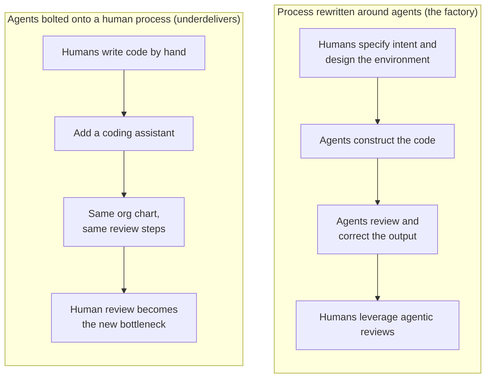

Most software consultancies bill, one way or another, for the work of building software. AI now does a growing share of that building, [^dx], which raises an interesting question for anyone who charges by the hour: if a tool absorbs much of the construction, what is the client still paying for?

{}Code must not be written by humans. Code must not be reviewed by humans.[^strongdm]{}

Anyone who has spent time watching how AI has changed software development realizes that the value of software engineering was never in the time spent typing. Generative AI is making that fact harder to ignore, and it is forcing a rethink of how value is measured and delivered without lowering the bar on quality. What clients are willing to pay for is changing. The billable hour was a good-enough approximation of value delivered, but with AI that equation makes less sense: the focus is shifting from time spent to outcomes produced. The freelancers, consultants, and consultancies that come through this shift strongest will be the ones that can upskill themselves and their teams to deliver those outcomes through orchestrated AI and building software factory automations while still taking responsibility for the result. The firms most exposed are not necessarily the ones AI makes irrelevant; they are the ones whose pricing has always been a function of hours rather than outcomes. They are the ones in danger of being priced out of the market, eventually.

## Beyond Cheaper Code: What Clients Now Expect

What clients have absorbed is not necessarily that software is cheaper. It is that results are now easier to produce and that they should arrive at AI speed, and therefore they should expect more software for the same price in less time. A proposal built around scoping a team and billing its hours now reads as friction rather than rigor. [^buyers]

{}DORA (DevOps Research and Assessment) is Google Cloud's long-running program benchmarking software-delivery performance across thousands of engineering teams. [^dora]{}

It helps to be precise about what AI actually changes. Even before AI, writing code was a minority of the work: studies put it at roughly 14 to 15 percent of a developer's time, with the rest going to design, review, and coordination.[^acm] And the productivity gains are neither uniform nor universal. A controlled trial found experienced engineers about 19 percent slower with AI on a mature codebase, even as they felt faster.[^metr] A large peer-reviewed study put the average output gain in the low single digits.[^science] And the DORA research finds that AI amplifies whatever a team already is: it helps disciplined teams and hurts brittle ones rather than delivering a uniform boost.[^dora] So the claim that AI simply makes software delivery faster and cheaper is generally simply not true. Whether AI helps deliver additional value at all depends on how the work is organized around it. And if AI automation is approached the wrong way, it can lead to serious reputational and financial damage. [^failures]

What does change is what clients believe they are buying. The hands-on construction of software used to be the most visible part of the job, and it is the part AI now absorbs. When a stakeholder watches working software take shape in an afternoon, the time you spent stops looking like the value you provide.

## Why the Billable Hour Is Under Pressure

Charging by the hour was always a proxy. A client cannot easily price the value of a system in advance, so both sides agree to price the input instead: days of skilled time. That proxy held as long as time spent correlated with the output produced. AI breaks this correlation by radically changing the time vs. output ratio. When the same result can be reached in a fraction of the time, billing for time quietly penalizes the consultancy that got faster and rewards the one that padded the estimate.

Clients feel this before they can articulate it. A buyer who has watched a prototype appear quickly is no longer willing to treat a timesheet as evidence of value.[^buyers] The pressure does not depend on AI actually being faster on every project, which the evidence says it is not.[^metr][^dora] It depends only on the client believing the work has gotten cheaper and pricing accordingly. The hour, as a unit of value, is being repriced by the changing market forces.

## From Selling Time to Selling Outcomes

If time no longer tracks value, the alternative is to price the value directly: outcome-based pricing, where the fee attaches to a defined, verified result rather than to days worked.[^obp] It is neither a new idea nor the same as value-based pricing, which estimates worth up front. Outcome pricing pays on what is actually delivered.

We will not claim the industry has already made this move. For bespoke software work, it largely has not, and there are honest reasons it is hard. Outcome pricing transfers real risk onto the consultancy: commit to a result, and if the work proves harder than expected, you absorb the difference instead of billing it. It demands that you can scope precisely, deliver reliably, and prove the outcome was met. That makes outcome pricing not just a different commercial model, but a more demanding operating discipline than selling time.

## Bridging the Gap

Outcome pricing is the destination, but few firms can jump to it cleanly, and few clients will sign a pure outcome contract overnight. A transitional model can carry both sides across, and it starts from the instrument most teams already use: the fixed price.

{}Splitting the value of saved hours de-risks the project. The client gets a price ceiling and faster delivery, while the developer avoids the "efficiency penalty" of hourly billing—aligning both to automate and ship faster.{}

Set the fixed price the usual way, from an honest estimate of the hours the work should take. Then add one clause: if the team delivers in fewer hours than estimated, the client and consultant split the value of the hours saved. The consultant is paid more than the time actually worked, rewarded for finishing early rather than penalized for it. The client pays less than the original fixed price and gets the result sooner. Both sides now want the same thing, speed, which is the incentive that time and materials quietly destroy.

That is why the model works as a bridge. The fixed price gives the client a familiar anchor and a trusted baseline for what the work was expected to cost. The shared-savings clause then makes efficiency visible: when AI, better processes, or stronger execution reduces the effort required, the gain is shared rather than captured entirely by the buyer or lost by the consultancy. The client pays less than the original fixed price, the consultant earns more than the hours actually worked, and both sides have a reason to care about speed without sacrificing the agreed result. It is not pure outcome pricing, but it moves the relationship in that direction. The firm begins to price the value of delivery, not just the labor behind it, while still operating inside a commercial structure both sides understand.

## The New Craft: Orchestration and Software Factories

Producing outcomes profitably, rather than merely promising them, is foremost an engineering problem. The DORA research makes the point sharply: AI does not lift every team equally; it rewards the ones with the discipline to use it well and punishes the ones without it. [^dora] The gains come from redesigning how the work is done, not from buying a tool and carrying on as before.

For software delivery, that redesign has a name with a longer history than most people assume. The industrialized "software factory" dates to the late 1960s: Hitachi opened its Hitachi Software Works in 1969, and NEC, Toshiba, and Fujitsu built similar operations through the mid-1970s, all chasing the same goal of standardized, repeatable, higher-quality production.[^factory] Microsoft revived the term in the mid-2000s for a model-driven, product-line approach that assembled applications from reusable parts.[^msft] Across six decades the pattern holds: standardize the work, reuse what you can, and push human effort up from construction toward design.[^factory][^mde][^msft]

{}Processes and systems designed around AI from the start-built for what agents can do-rather than a human-centered process with AI tools bolted on afterward.[^recinq]{}

The AI-native version is not the old lifecycle with agents bolted on; it is a rewrite of the surrounding lifecycle. As one practitioner defines it, a software factory is "a system where agents produce the code and humans design the system those agents operate within," one that "doesn't bolt agents onto your existing process" but "replaces the process."[^recinq] That redesign unlocks the real automation potential that AI provides us: inside an organization, fundamentally redesigning the workflow has the biggest single effect on whether AI reaches the bottom line, and most of what makes it work is people and process, not the technology.[^mckinsey][^bcg] Handing developers a coding assistant while the org chart, the review steps, and the workflow stay built for humans writing code by hand is the move that reliably underdelivers.[^metr][^dora] The factory inverts it: people specify intent and design the environment the agents run in, and the agents do the construction.[^strongdm][^recinq] 

That second skill, orchestration, is the new daily craft for engineers: directing a set of agents, steering their output, and deciding what is correct. It is closer to leading a small team than to being a developer. Accenture already sells a version of this to its own clients, an "AI Refinery" that assembles agents like a production line.[^refinery]

This puts verification at the center, and it changes what verification means. AI output is fast and frequently wrong: only about a third of developers say they trust it without checking.[^acm] When agents write the code and people do not review every line, the question shifts from "did the test suite pass" to "across many runs, how often does the system actually do what the user wanted." StrongDM runs a factory where, by rule, no human writes or reviews the code. It describes exactly that move: from a boolean definition of success to a probabilistic one that scores the fraction of agent runs that satisfy user intent. [^strongdm] Evaluation stops being a gate at the end of the pipeline and becomes the product itself. Automate the construction, and the work that remains is the part you cannot hand off: deciding what to build and proving its quality meets or exceeds expectations.

{}A Wardley map positions each part of the value chain by how evolved it is, from novel on the left to commodity on the right, and the arrows show which way each is moving. Construction, coding agents, and foundation models are sliding toward commodity, while orchestration and senior judgment stay scarce on the left. The flagged risks: outcome pricing shifts delivery risk onto the consultancy, and coding as craft resists industrialization.{}

## What Consultancies Must Do: Redesign and Upskill

Two changes follow, one to the offer and one to the people.

The first change is to what you sell. Stop selling staffed time and start selling outcomes the firm can produce repeatably. Start building your software factory; its blueprint becomes an asset that can be reused across clients and can be continuously improved.

The second change is to the people, and the skill that matters most is orchestration. An orchestrator does not type faster. They help design the environment a set of agents runs in, the specifications, the test harnesses, and the guardrails so the agents can check and correct their own output instead of handing every line back to a person. That last part is the crux. If a human still has to read and approve everything an agent writes, review becomes the new bottleneck, and the speed benefits of using generative AI are gone.[^metr] The factories that work make verification part of the system itself: StrongDM's agents run against scenario harnesses and converge without human review,[^strongdm] and [^recinq] frames the human role as designing the system the agents operate within, not inspecting every commit.[^recinq] Humans only have to review the items that AI surfaces to them; it cannot decide, removing much of the noise and thereby mitigating the review bottleneck. Building that self-correcting environment is what allows scaling the software factory beyond the limits of human review and attention. [^strongdm][^recinq] 

The tools and the agents are buyable; the operating model, the specifications, the test harnesses, and the discipline to run them are not. [^bcg] The advantage will not go to whoever adopts AI first; the evidence already shows it rewards the teams disciplined enough to redesign around it and implement an agentic software development lifecycle (SDLC). [^dora]

## From Software Engineering to Software Factory Engineering

Today, agents are already writing and checking code inside real factories, while people design the systems they run in. The patterns we can see are consistent: AI compresses the construction of software but not the surrounding judgment. Time spent stops being a proxy for measuring value. The companies that adapt to the changing market forces are moving from selling hours to selling outcomes and from writing code to running the factory that produces it. What stays scarce is the part no agent can own: deciding what to build, what good looks like, ensuring the outcome is high quality, and meeting customer expectations.

So far the change shows up on one side more than the other: among the firms that build software, not the clients who buy it. Accenture is selling an agent factory to clients,[^refinery] StrongDM runs one internally where no human writes or reviews the code,[^strongdm] and practitioners are publishing blueprints for AI-native delivery.[^recinq] The pricing side still lags a bit behind: outcome-based contracts for bespoke software remain rare, and whether they scale beyond productized AI is genuinely open. Which leaves the question: when AI has absorbed the construction, where do you stand? Are you still selling the hours? Are your customers slow and sticky enough so you can afford not changing, or are you already feeling the pressure to change your pricing model and upskill your workforce to build the ability and capacity to run a software factory?

<!-- [Comment on LinkedIn](LINK_TO_BE_ADDED) -->

## References

[^dx]: DX, "AI-Assisted Engineering" research hub, on how much hands-on coding AI assistants now take on. https://getdx.com/blog/ai-assisted-engineering-hub/
[^buyers]: Consultancy-ME, "How AI and Gen AI will transform the consulting industry," on clients increasingly expecting AI built into delivery. https://www.consultancy-me.com/news/10130/how-ai-and-gen-ai-will-transform-the-consulting-industry
[^acm]: ACM Queue, "Eight Myths on Software Engineering and GenAI," on coding as a minority of developer time and on low trust in AI-generated code. https://queue.acm.org/detail.cfm?id=3807963
[^metr]: METR, "Measuring the Impact of Early-2025 AI on Experienced Open-Source Developers," a randomized trial finding experienced developers about 19 percent slower with AI despite feeling faster. https://metr.org/blog/2025-07-10-early-2025-ai-experienced-os-dev-study/
[^science]: Daniotti and colleagues, Science (2026), a large study estimating a low-single-digit average productivity gain from AI coding tools. https://www.science.org/doi/10.1126/science.adz9311
[^dora]: DORA, 2024 Accelerate State of DevOps Report, finding that AI amplifies a team's existing strengths and weaknesses rather than delivering a uniform gain. https://dora.dev/research/2024/dora-report/
[^obp]: Horizon Labs, "Outcome-Based Pricing: 2026 Guide," defining outcome-based pricing and how it differs from value-based pricing. https://www.horizon-labs.co/resources/outcome-based-pricing-guide-how-it-works-examples
[^factory]: Wikipedia, "Software factory," on the concept's origin in Japan in the late 1960s (Hitachi Software Works, 1969) and its evolution since. https://en.wikipedia.org/wiki/Software_factory
[^msft]: Wikipedia article on Microsoft's software factory initiative, the mid-2000s model-driven, product-line revival of the term. https://en.wikipedia.org/wiki/Software_factory_%28Microsoft_.NET%29
[^recinq]: Michael Mueller, "Building Software Factories: The Blueprint for AI-Native Delivery", 4 March 2026, on the AI-native software factory as a replacement for the existing process rather than agents bolted onto it. https://re-cinq.com/blog/building-agent-factories
[^strongdm]: Justin McCarthy (CTO, StrongDM), "Software Factories and the Agentic Moment," 6 February 2026, on a factory where agents write and check code with no human review, and where success shifts from passing tests to a probabilistic "satisfaction" score. https://factory.strongdm.ai
[^refinery]: Accenture, "AI Refinery," the firm's productized platform for assembling and orchestrating AI agents for clients. https://www.accenture.com/us-en/services/ai-data/ai-refinery
[^failures]: Two cautionary cases of AI adopted the wrong way. Klarna reversed its AI-first customer-service strategy and resumed hiring human agents after over-prioritising cost hurt service quality - eMarketer, citing Bloomberg News, "Klarna backtracks on AI customer service plans," 8 May 2025, https://www.emarketer.com/content/klarna-backtracks-ai-customer-service-plans. And Uber burned through its entire 2026 AI coding-tools budget in four months, with its COO unable to tie the spend to customer value ("that link is not there yet") - Jake Angelo, "Uber burned through its entire 2026 AI budget in four months. Now its COO is questioning whether it's worth it," Fortune, 26 May 2026, https://fortune.com/2026/05/26/uber-coo-ai-spending-tokens-claude-code/.
[^mckinsey]: McKinsey & Company (QuantumBlack), "The State of AI: How organizations are rewiring to capture value," March 2025, finding that of the attributes tested, the redesign of workflows has the biggest effect on whether organizations see EBIT impact from generative AI. https://www.mckinsey.com/capabilities/quantumblack/our-insights/the-state-of-ai-how-organizations-are-rewiring-to-capture-value
[^bcg]: BCG, "Closing the AI Impact Gap," 2025, on the 10-20-70 principle: roughly 10 percent of AI value comes from algorithms, 20 percent from data and technology, and 70 percent from people, process, and change. https://www.bcg.com/publications/2025/closing-the-ai-impact-gap
[^mde]: Wikipedia, "Model-driven engineering," on the model-driven lineage from 1980s CASE tools through UML to the OMG's Model-Driven Architecture in the 2000s - the standardise-and-generate impulse bridging the original software factories and today's AI-native ones. https://en.wikipedia.org/wiki/Model_Driven_Engineering