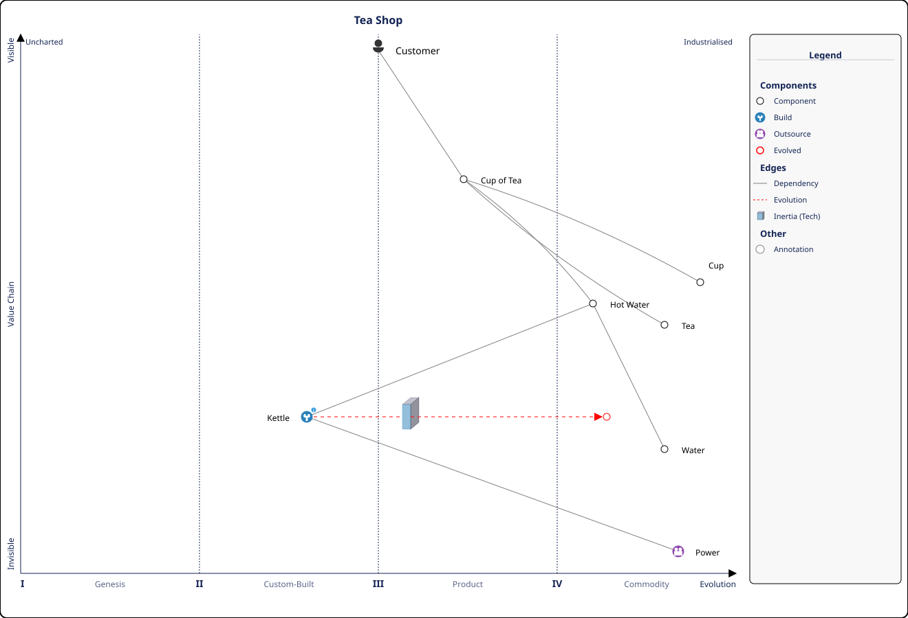

> **This is a test page.** It exists solely to verify that sidenote tooltips render correctly. Do not publish.

<!--more-->

## Purpose

This page tests the sidenote tooltip component. Each sidenote type below should render as an interactive tooltip.

## Sidenote Types

This framing technique is sometimes called persona prompting in the literature. Research from Microsoft suggests it can improve task accuracy by 10–15% on domain-specific benchmarks.

**← sidenote inserted here** - This paragraph tests a **Note** sidenote. Lorem ipsum dolor sit amet, consectetur adipiscing elit. Sed do eiusmod tempor incididunt ut labore et dolore magna aliqua. Ut enim ad minim veniam, quis nostrud exercitation ullamco laboris nisi ut aliquip ex ea commodo consequat. Duis aute irure dolor in reprehenderit in voluptate velit esse cillum dolore eu fugiat nulla pariatur. Excepteur sint occaecat cupidatat non proident, sunt in culpa qui officia deserunt mollit anim id est laborum.

Sed ut perspiciatis unde omnis iste natus error sit voluptatem accusantium doloremque laudantium, totam rem aperiam, eaque ipsa quae ab illo inventore veritatis et quasi architecto beatae vitae dicta sunt explicabo. Nemo enim ipsam voluptatem quia voluptas sit aspernatur aut odit aut fugit, sed quia consequuntur magni dolores eos qui ratione voluptatem sequi nesciunt.

Constraints are the friend of creativity. They force you to think harder, not less.

**← sidenote inserted here** - This paragraph tests a **Quote** sidenote. Neque porro quisquam est, qui dolorem ipsum quia dolor sit amet, consectetur, adipisci velit, sed quia non numquam eius modi tempora incidunt ut labore et dolore magnam aliquam quaerat voluptatem. Ut enim ad minima veniam, quis nostrum exercitationem ullam corporis suscipit laboriosam, nisi ut aliquid ex ea commodi consequatur.

Quis autem vel eum iure reprehenderit qui in ea voluptate velit esse quam nihil molestiae consequatur, vel illum qui dolorem eum fugiat quo voluptas nulla pariatur. At vero eos et accusamus et iusto odio dignissimos ducimus qui blanditiis praesentium voluptatum deleniti atque corrupti quos dolores et quas molestias excepturi sint occaecati cupiditate non provident, similique sunt in culpa qui officia deserunt mollitia animi.

When building few-shot examples, aim for 2–3 that cover the range of expected inputs. More than 5 examples usually hits diminishing returns and wastes context window.

**← sidenote inserted here** - This paragraph tests a **Tip** sidenote. Id est laborum et dolorum fuga. Et harum quidem rerum facilis est et expedita distinctio. Nam libero tempore, cum soluta nobis est eligendi optio cumque nihil impedit quo minus id quod maxime placeat facere possimus, omnis voluptas assumenda est, omnis dolor repellendus.

Temporibus autem quibusdam et aut officiis debitis aut rerum necessitatibus saepe eveniet ut et voluptates repudiandae sint et molestiae non recusandae. Itaque earum rerum hic tenetur a sapiente delectus, ut aut reiciendis voluptatibus maiores alias consequatur aut perferendis doloribus asperiores repellat.

Anthropic's prompt engineering documentation covers many of these patterns in depth, with interactive examples you can modify and test directly.

**← sidenote inserted here** - This paragraph tests a **See also** sidenote. Excepteur sint occaecat cupidatat non proident, sunt in culpa qui officia deserunt mollit anim id est laborum. Curabitur pretium tincidunt lacus. Nulla gravida orci a odio. Nullam varius, turpis et commodo pharetra, est eros bibendum elit, nec luctus magna felis sollicitudin mauris.

Integer in mauris eu nibh euismod gravida. Duis ac tellus et risus vulputate vehicula. Donec lobortis risus a elit. Etiam tempor. Ut ullamcorper, ligula eu tempor congue, eros est euismod turpis, id tincidunt sapien risus a quam. Maecenas fermentum consequat mi.

## Wardley map

This section verifies the `wtg2svg` rendering pipeline. The image below is generated from `map.wtg2` (sidecar file in this page bundle) by `just wardley-render`.

The same map with the zoom lightbox enabled:

