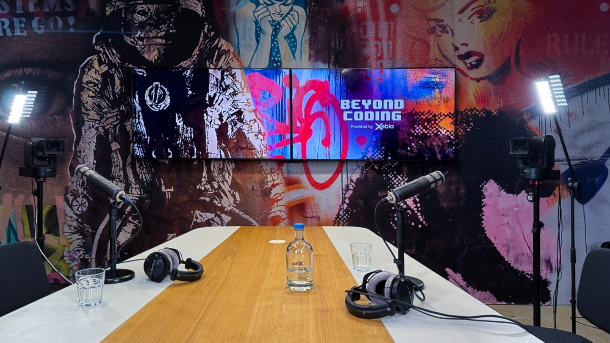

I recently joined Patrick Akil on [Beyond Coding](https://open.spotify.com/show/7asIKIPU3N6n0SNWHxwMnQ) post. A podcast he created for software engineers who want to grow past writing code: technical mastery, AI, product thinking, and career growth. Over 270 episodes in, he's interviewed CTOs, principal engineers, and tech leaders, and it was a genuine pleasure to sit on the other side of the microphone for once. Thanks to Patrick for the conversation and for making it such an easy, thoughtful experience.

### What We Talked About

We talked about why code review is becoming the bottleneck in AI-assisted software engineering: generating code is getting cheaper, but understanding, validating, and maintaining that code is not. The conversation focused on how teams can shift review work upstream by using specifications, tests, static checks, architectural constraints, and project-specific guardrails to give agents useful feedback before humans have to step in. We also touched on the changing role of engineers: less manual implementation, more system design, clearer intent, and stronger ownership of the environment in which AI tools operate.

### Listen to the Episode

- [On Spotify](https://open.spotify.com/episode/3ro3ArGRgPh9PQ8Xt8caGU?si=183dcd46fb6b4848)
- [On Apple Podcasts](https://podcasts.apple.com/us/podcast/how-top-engineers-are-solving-the-code-review-bottleneck/id1572440477?i=1000772025902)

To comment or share please head on over to [LinkedIn](https://www.linkedin.com/posts/fbuetow_i-recently-joined-patrick-akil-on-the-beyond-share-7470498139343396864-tEYO/)

## References

- [Beyond Coding on Spotify](https://open.spotify.com/show/7asIKIPU3N6n0SNWHxwMnQ)
- [Beyond Coding on Apple Podcasts](https://podcasts.apple.com/us/podcast/beyond-coding/id1572440477)
- [Beyond Coding on YouTube](https://www.youtube.com/@BeyondCoding)
