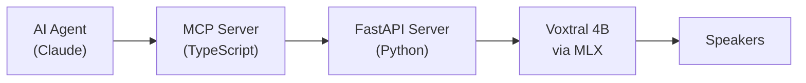

[github.com/florianbuetow/tts-mcp](https://github.com/florianbuetow/tts-mcp)

When you kick off a long-running task with an autonomous agent, whether it is Claude Code, Codex, or a custom runner, you usually end up locked into the terminal. You sit there, watching text buffers scroll, waiting to see when it finishes, breaks, or needs human input.

Personally, I don't want to watch a terminal. I want to be able to pace around the room, let my mind wander, and actually think about the system architecture while the agents execute their tasks in the background.

To achieve that, I decided to equip my agents with a way to report their status to me via audio and built a local voice layer for autonomous tooling: TTS-MCP.

TTS-MCP is open-source and exposes a local text-to-speech engine, based on Mistral's open-weight Voxtral TTS models, directly to your AI agents via MCP. You simply prompt them to use TTS-MCP to give you a TLDR when they are done or need human input because they got stuck. And they'll literally just tell you.

Here is a sample of the local voice output:



## The Architecture

The architecture is entirely self-hosted and straightforward:

The system coordinates a few distinct pieces to make the interaction seamless:

- Local Inference: It runs Mistral's Voxtral 4B text-to-speech model. The weights stay in memory via the TTS API Server, running completely offline with no API costs or cloud privacy leaks.
- Lookahead Chunking: To eliminate the latency gap between sentences, the FastAPI backend processes requests sequentially through a background work queue using a lookahead pattern - generating the next semantic audio slice while your speakers are still playing the current one.
- Broadcast-Standard Loudness Matching: Synthetic voices vary in their base gain levels. To keep transitions smooth, the audio pipeline passes every generated utterance through a boost-only normalization filter to keep playback levels balanced.

If you want to run TTS-MCP yourself, the setup instructions are provided in the links below.

## Links

- [TTS-MCP project page](/projects/tts-mcp/)
- TTS-MCP source on [GitHub](https://github.com/florianbuetow/tts-mcp)
