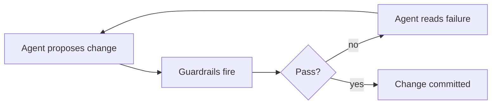

# Article Formatting Guide

How to format article content in this blog. Covers the three things you actually need to remember: the references section, Mermaid diagrams, and sidenotes.

For broader conventions (file layout, build commands, when to use `slug`), see `CLAUDE.md`.

---

## 1. References section

Every article ends with the same closing block, in this order:

1. A `[Comment on LinkedIn](url)` link.
2. A `## References` (or `## Sources`) heading.
3. A bullet list of links, each with a descriptive label — never a bare URL.

### Template

```markdown
[Comment on LinkedIn](https://www.linkedin.com/feed/update/urn:li:activity:XXXXXXXXXXXXXXXXXXXX/)

## References

- [Descriptive label for the source](https://example.com/path)
- [Another source — what it is](https://example.com/other)
```

### Notes

- The LinkedIn URL must come from the actual LinkedIn post file outside this repo. Don't invent activity IDs.
- Use `## References` for ticker articles and `## Sources` for longer essays — both are accepted; pick one and stay consistent within the article.
- Descriptive link text — readers, screen readers, and search engines all benefit. `[Hugo docs on shortcodes](...)` beats `[link](...)` or `[https://gohugo.io/...](...)`.
- Nothing should follow the references list. The references block is the article's footer.

---

## 2. Mermaid diagrams

Mermaid is rendered client-side from a locally bundled package. The JS only loads on pages that actually contain a Mermaid block, so there's no cost on articles without one.

### How to write one

Use a fenced code block with the `mermaid` language tag. That's it — no shortcode needed.

````markdown

````

### Notes

- Any Mermaid diagram type works (`flowchart`, `sequenceDiagram`, `classDiagram`, `stateDiagram`, `gantt`, etc.) — the renderer is the upstream Mermaid package.
- Use `<br/>` inside node labels for line breaks. Quote labels that contain spaces or special characters: `A["Some label<br/>with two lines"]`.
- Preview locally with `just dev` — Mermaid renders in-browser, so a saved file should refresh and show the diagram immediately.
- Don't paste an SVG export. The whole point of writing the diagram source is that it stays diffable.

---

## 3. Sidenotes and sidequotes

Two shortcodes float content into the right margin of the article column:

- `sidenote` — labelled aside (Note / Tip / See also / …).
- `sidequote` — pull quote with an optional attribution.

Both are inline shortcodes — place them immediately before the paragraph they should sit alongside.

### Sidenote

```markdown
This framing technique is sometimes called persona prompting. Microsoft research suggests 10–15% accuracy gains on domain-specific benchmarks.

The paragraph this sidenote attaches to goes here. The note floats into the right column next to it.
```

- `label` is optional but recommended. Conventional labels: `Note`, `Tip`, `See also`, `Caveat`, `Aside`.
- The body supports inline Markdown — links, emphasis, code spans all work.
- Keep sidenotes short. One or two sentences. If it needs a paragraph, it belongs in the main text.

### Sidequote

```markdown
Constraints are the friend of creativity. They force you to think harder, not less.

The paragraph the quote sits beside goes here.
```

- `cite` is optional. When present, it renders as an attribution line (`— Marvin Minsky`).
- Use sparingly — one or two per article. Sidequotes lose their effect when they stack.

### Placement rules

- One sidenote/sidequote per paragraph. Two in a row collide visually.
- Place the shortcode **before** the paragraph it should align with. Hugo renders it inline, and the CSS floats it.
- On narrow viewports the floated column collapses and the sidenote falls inline. Write the body so it reads naturally in both layouts.

---

## Reference article

`content/blog/2026-05-17-yes-you-are-absolutely-right/index.md` uses Mermaid diagrams and the references section.
`content/blog/test-sidenotes.md` exists specifically to exercise the sidenote and sidequote shortcodes — open it side-by-side with the rendered page when iterating.
