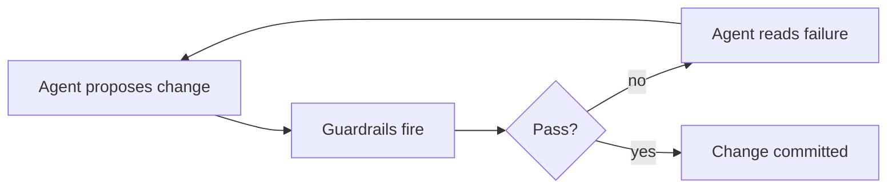

# Article Formatting Guide

How to format article content in this blog. Covers: dashes (global style rule), the references section, Mermaid diagrams, and sidenotes.

For broader conventions (file layout, build commands, when to use `slug`), see `CLAUDE.md`.

---

## 1. Dashes

**Never use em dashes (`—`), en dashes (`–`), or any other Unicode dash character anywhere in article content.** The only dash character allowed in this repo is the ASCII hyphen-minus (`-`).

This rule applies to:

- All article prose (`content/blog/`, `content/ticker/`, `content/projects/`, `content/about.md`, top-level pages).
- Front-matter strings (titles, descriptions, subtitles).
- Headings, list items, and link labels.
- Comments inside fenced code blocks (the code itself can use whatever the language requires).
- Layout files (`layouts/`) that produce text the reader will see, including shortcode templates.

### Forbidden characters

| Character | Name | Codepoint |
|---|---|---|
| `—` | Em dash | U+2014 |
| `–` | En dash | U+2013 |
| `‒` | Figure dash | U+2012 |
| `―` | Horizontal bar | U+2015 |
| `−` | Minus sign | U+2212 |

### How to replace

Do NOT blindly substitute every em dash with an ASCII hyphen. In almost every case the right replacement is a comma, period, or colon, not a hyphen. Decide based on what the dash is doing in the sentence:

| Role of the dash | Replace with |
|---|---|
| Strong pause or sentence break | Period (`.`) |
| Inserting a clause | A pair of commas (`, ... ,`) |
| Introducing a list or definition | Colon (`:`) |
| Setting off a parenthetical | Parentheses (`(...)`) |
| Compound modifier (e.g. `petabyte-scale`) | ASCII hyphen (`-`) |

### Why this rule exists

Unicode dashes have become a tell for AI-written text. Even when stylistically correct, an em dash inside a personal essay signals "machine wrote this" to a meaningful share of readers. Plain ASCII punctuation does the same work without the tell.

### Auditing a file

Search the file for the literal characters `—` and `–`. Anything you find is a violation. Replace each per the table above.

---

## 2. References section

Every article ends with the same closing block, in this order:

1. A `[Comment on LinkedIn](url)` link.
2. A `## References` (or `## Sources`) heading.
3. A `resources` shortcode listing the sources. This is the standard format for the closing section of every article.

### Template

```markdown
[Comment on LinkedIn](https://www.linkedin.com/feed/update/urn:li:activity:XXXXXXXXXXXXXXXXXXXX/)

## References


[Descriptive label for the source](https://example.com/path) | What this source is and why it is cited.
[Another source, what it is](https://example.com/other) | One-sentence description of the source.

```

### How the `resources` shortcode works

- One row per non-empty line inside the shortcode body.
- Each row has two cells separated by a single `|` character: the link on the left, the description on the right.
- Both cells accept inline Markdown. The link cell is always wrapped in `<strong>` by the template, so write a plain `[label](url)`, not `**[label](url)**`.
- The shortcode emits a `<table class="resources-table">`. The same CSS class powers the dedicated [resources](/resources/) page, so the appearance stays consistent across the site.
- Every `<a>` in the rendered table is emitted with `target="_blank" rel="noopener"`, so all reference links open in a new tab by default. You do not need to write the anchor by hand to get this behaviour.
- A row with zero or more than one `|` is a hard error. The build will fail with `resources shortcode: expected exactly one \`|\` per row`.

### Notes

- The LinkedIn URL must come from the actual LinkedIn post file outside this repo. Don't invent activity IDs.
- Use `## References` for ticker articles and `## Sources` for longer essays. Both are accepted; pick one and stay consistent within the article.
- Use descriptive link text. Readers, screen readers, and search engines all benefit. `[Hugo docs on shortcodes](...)` beats `[link](...)` or `[https://gohugo.io/...](...)`.
- Do not hand-write an HTML `<table>` block for sources. Use the `resources` shortcode so the markup stays in one place.
- Nothing should follow the references list. The references block is the article's footer.

---

## 3. Mermaid diagrams

Mermaid is rendered client-side from a locally bundled package. The JS only loads on pages that actually contain a Mermaid block, so there's no cost on articles without one.

### How to write one

Use a fenced code block with the `mermaid` language tag. That's it. No shortcode needed.

````markdown

````

### Notes

- Any Mermaid diagram type works (`flowchart`, `sequenceDiagram`, `classDiagram`, `stateDiagram`, `gantt`, etc.). The renderer is the upstream Mermaid package.
- Use `<br/>` inside node labels for line breaks. Quote labels that contain spaces or special characters: `A["Some label<br/>with two lines"]`.
- Preview locally with `just dev`. Mermaid renders in-browser, so a saved file should refresh and show the diagram immediately.
- Don't paste an SVG export. The whole point of writing the diagram source is that it stays diffable.

---

## 4. Wardley maps

Wardley maps are rendered at build time from a `.wtg2` source file (the [wardleyToGo](https://github.com/owulveryck/wardleyToGo) DSL) into an SVG that ships as a normal page-bundle asset. Both the `.wtg2` source and the generated `.svg` are committed to git.

### How to write one

1. Inside the article's page-bundle directory, create the DSL source as `map.wtg2`. For multiple maps in the same article, use descriptive basenames (e.g., `auth-evolution.wtg2`, `data-platform.wtg2`).
2. Run `just wardley-render`. This walks `content/**/*.wtg` and produces a `.svg` of the same basename next to each `.wtg2`, using `wtg2svg -static`.
3. Reference the generated SVG with standard Markdown image syntax:

   ```markdown
   
   ```

4. Commit both `map.wtg2` and `map.svg` together.

### Notes

- The `?zoom` lightbox documented in section 6 works for SVG too: ``.
- The render hook (`layouts/_default/_markup/render-image.html`) detects `.svg` files by suffix and emits them without explicit `width`/`height`. The browser uses the SVG's intrinsic `viewBox` for sizing.
- After editing any `.wtg2`, re-run `just wardley-render` before committing. The generated `.svg` must travel with its source.
- `validate-images` enforces that any non-draft article referencing a `.svg` has the file present, so a forgotten render is caught by CI.
- The renderer (`wtg2svg`) is installed by `just init` at a pinned commit SHA; see the install block in the justfile for the rationale.
- DSL reference and examples: see the [wardleyToGo](https://github.com/owulveryck/wardleyToGo) repository (`sample.wtg` in the repo root is a good starting point).

---

## 5. Sidenotes and sidequotes

Two shortcodes float content into the right margin of the article column:

- `sidenote`: labelled aside (Note / Tip / See also / ...).
- `sidequote`: pull quote with an optional attribution.

Both are inline shortcodes. Place them immediately before the paragraph they should sit alongside.

### Sidenote

```markdown
This framing technique is sometimes called persona prompting. Microsoft research suggests 10-15% accuracy gains on domain-specific benchmarks.

The paragraph this sidenote attaches to goes here. The note floats into the right column next to it.
```

- `label` is optional but recommended. When the sidenote defines or explains a specific term, use that term as the label (e.g. `label="Hard Guardrail"`), not a generic word like `Definition`. Generic labels like `Note`, `Tip`, `See also`, `Caveat`, `Aside` are for contextual asides that do not define a single term.
- The body supports inline Markdown. Links, emphasis, code spans all work.
- Keep sidenotes short. One or two sentences. If it needs a paragraph, it belongs in the main text.

### Sidequote

```markdown
Constraints are the friend of creativity. They force you to think harder, not less.

The paragraph the quote sits beside goes here.
```

- `cite` is optional. When present, it renders as an attribution line.
- **Known violation of the Dashes rule:** the sidequote shortcode template currently emits an em dash before the citation name. To bring it into compliance, edit `layouts/shortcodes/sidequote.html` to use an ASCII hyphen (or a colon, period, etc.) instead. Until that change ships, every sidequote on the site silently violates Section 1.
- Use sparingly. One or two per article. Sidequotes lose their effect when they stack.

### Placement rules

- One sidenote/sidequote per paragraph. Two in a row collide visually.
- Place the shortcode **before** the paragraph it should align with. Hugo renders it inline, and the CSS floats it.
- **Never place a sidenote in the middle of a sentence.** It must always stand alone on its own line, before the paragraph it annotates.
- On narrow viewports the floated column collapses and the sidenote falls inline. Write the body so it reads naturally in both layouts.

---

## 6. Zoomable images

Append `?zoom` to any image path to make it clickable. Clicking the image opens a full-resolution lightbox overlay.

### Syntax

```markdown

```

### How it works

The render hook (`layouts/_default/_markup/render-image.html`) strips `?zoom` from the src, adds `class="zoomable"` and a `data-zoom-src` attribute pointing to the full-resolution file. `assets/js/lightbox.js` attaches the click handler; `assets/css/main.css` sets `cursor: zoom-in`.

### Notes

- **Always append `?zoom` to images in blog and ticker posts.** This is the default for all content images.
- Works with page-bundle images (most common) and external URLs alike.
- The title string becomes the `title` attribute on the `` tag -- it appears as a browser tooltip, not a caption.
- Use for illustrations, screenshots, or any image where detail matters at full size. Skip it for decorative images.
- One zoom per paragraph is enough; don't stack multiple zoomable images side by side.

---

## 7. Links that open in a new tab

Markdown's `[text](url)` syntax has no way to set `target="_blank"`. Use a raw HTML anchor instead. This works because `markup.goldmark.renderer.unsafe = true` is set in `hugo.toml`.

```markdown
<a href="https://example.com" target="_blank" rel="noopener">link text</a>
```

Use `rel="noopener"` whenever you set `target="_blank"` — it prevents the opened page from accessing `window.opener`.

---

## Reference article

`content/blog/2026-05-17-yes-you-are-absolutely-right/index.md` uses Mermaid diagrams and the references section.
`content/blog/test-article/` exists specifically to exercise the sidenote, sidequote, and Wardley map rendering pipelines. Open it side-by-side with the rendered page when iterating.
